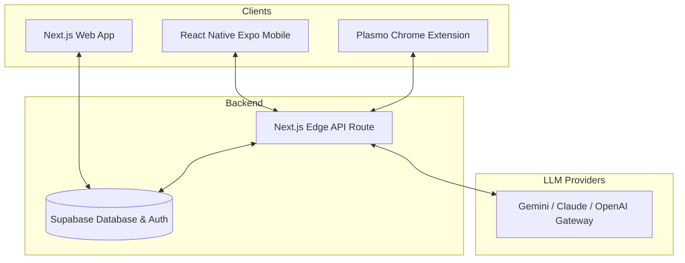

# PromptPilot

> **A Cross-Platform Prompt Engineering Workspace & Universal Text Optimization Suite**

PromptPilot is a unified ecosystem designed to streamline prompt engineering, quality scoring, and inline text optimization. Featuring a centralized web workspace, a background-synced browser extension, and a companion mobile client, PromptPilot brings advanced LLM capabilities directly into your writing workflows.

---

## 📖 Table of Contents

1. [Executive Overview](#-executive-overview)
2. [Key Workflows & Features](#-key-workflows--features)
3. [Technical Architecture](#-technical-architecture)
4. [Implementation Details](#-implementation-details)
5. [Visual Proof](#-visual-proof)
6. [Setup Instructions](#-setup-instructions)

---

## 🌟 Executive Overview

### The Problem
Prompt engineering is often fragmented. Developers and content creators constantly cycle between multiple browser tabs, manually tailoring instructions for different LLMs (such as ChatGPT, Claude, and Gemini), grading draft quality by trial-and-error, and copying/pasting results. In addition, applying these optimized prompts inside standard web pages or mobile apps remains a clunky, manual task.

### The Solution
PromptPilot centralizes prompt creation, validation, and execution. By combining a Next.js web application for prompt creation and scoring, a Supabase backend for persistent synchronization, a companion React Native mobile app, and a Plasmo-powered browser extension that dynamically injects AI rewriting widgets into any input field, PromptPilot creates a seamless pipeline from prompt design to execution.

---

## 🛠️ Key Workflows & Features

* **AI Prompt Optimizer & Rewriter**: Refines raw drafts into structural, context-rich, constraint-driven prompts tailored to target platforms (ChatGPT, Claude, Gemini, DeepSeek).
* **Quality Scoring System**: Grades drafts from 0 to 100 on *Clarity, Context, Constraints, Structure, and Specificity*, providing clear explanations (Action, Why, How) of all changes made.
* **Dynamic Variations & Library**: Generates alternative prompt choices, allowing users to save their favorite outputs directly to a synced Prompt Library.
* **Dynamic Templates**: Preset prompt frameworks (such as Resume Reviewers, Cover Letter Generators, and SQL Generators) that compile dynamic bracketed fields (e.g., `[Target Role]`) into prompts instantly.
* **Inline Web Injection**: The browser extension overlays an AI rewrite panel directly next to focused text inputs on any web page, allowing users to optimize drafts inline and insert the results seamlessly.
* **Account Restoration & Soft Deletes**: Implements a secure privacy workflow that queues accounts for deletion for 30 days while offering one-click profile restoration from the dashboard.

---

## 📐 Technical Architecture

PromptPilot uses a monorepo structure separating frontend, database, mobile, and extension concerns.



### Design Decisions
* **Shadow DOM Isolation**: The browser extension uses a Shadow DOM container to inject its UI, preventing style pollution or collisions with host web pages.
* **Credential Sharing**: The extension listens to session messages on the dashboard domain, caching auth tokens in secure local extension storage to authenticate API proxy requests.
* **Real-time Synchronization**: Supabase realtime channels keep active dashboard sessions updated instantly across user devices.

---

## 🚀 Implementation Details

### Core Tech Stack
* **Web Dashboard**: Next.js (App Router), Tailwind CSS, Lucide icons.
* **Mobile Client**: React Native, Expo, Ionicons, SafeArea views.
* **Browser Extension**: Plasmo Framework (Manifest V3), TypeScript, Shadow DOM styling.
* **Database & Auth**: Supabase PostgreSQL database, Row-Level Security (RLS) policies, and JWT token authentication.
* **AI Processing**: LLM caller abstraction with support for model selection, custom API key overrides, and structured JSON parsing.

---

## 📸 Visual Proof

Below are placeholders for the visual demonstration of PromptPilot across all platforms:

| Next.js Web Dashboard | Chrome Extension Overlay | React Native Mobile App |
| :---: | :---: | :---: |
|  |  |  |

---

## ⚙️ Setup Instructions

### 1. Backend Configuration (Supabase)
To spin up the database schema, make sure you have the [Supabase CLI](https://supabase.com/docs/guides/cli) installed:
```bash
# Start Supabase locally
supabase start

# Apply migrations
supabase db reset
```

### 2. Next.js Web App (`/web`)
1. Navigate to `/web` and copy `.env.local.example` to `.env.local` with your Supabase credentials:
   ```env
   NEXT_PUBLIC_SUPABASE_URL=your-supabase-project-url
   NEXT_PUBLIC_SUPABASE_PUBLISHABLE_KEY=your-supabase-anon-key
   SUPABASE_SERVICE_ROLE_KEY=your-supabase-service-role-key
   ```
2. Install dependencies and start the dev server:
   ```bash
   npm install
   npm run dev
   ```
3. Open [http://localhost:3000](http://localhost:3000) in your browser.

### 3. Chrome Extension (`/extension`)
1. Navigate to `/extension` and install dependencies:
   ```bash
   npm install
   npm run dev
   ```
2. Open Chrome, go to `chrome://extensions/`, enable **Developer mode**, and click **Load unpacked**.
3. Select the folder `/extension/build/chrome-mv3-dev`.

### 4. React Native Mobile App (`/mobile`)
1. Navigate to `/mobile` and install dependencies:
   ```bash
   npm install
   ```
2. Run the Metro bundler:
   ```bash
   npx expo start
   ```
3. Scan the QR code with your iOS/Android device to run the app.