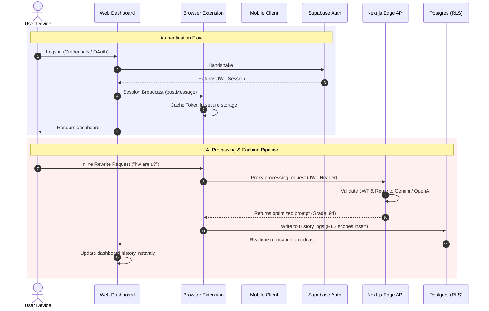
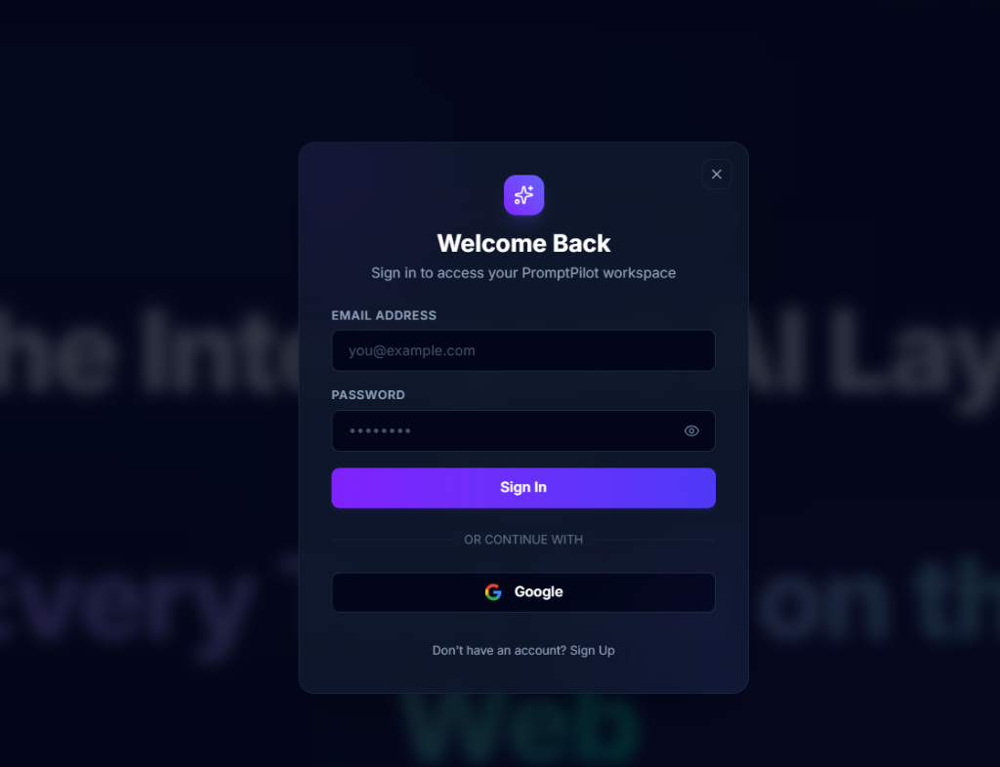
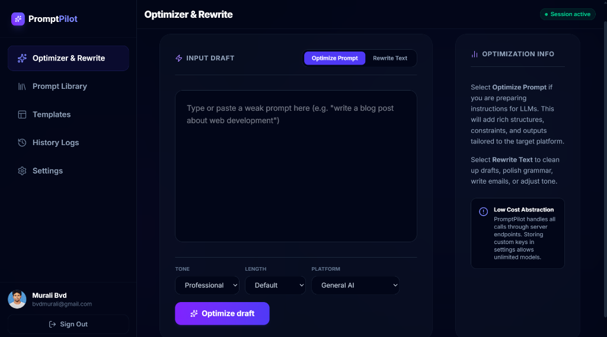
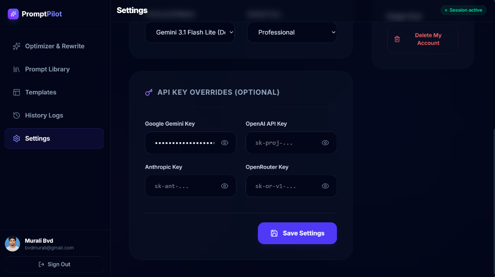
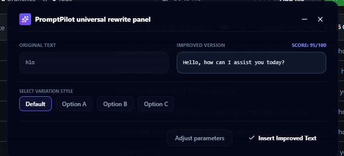
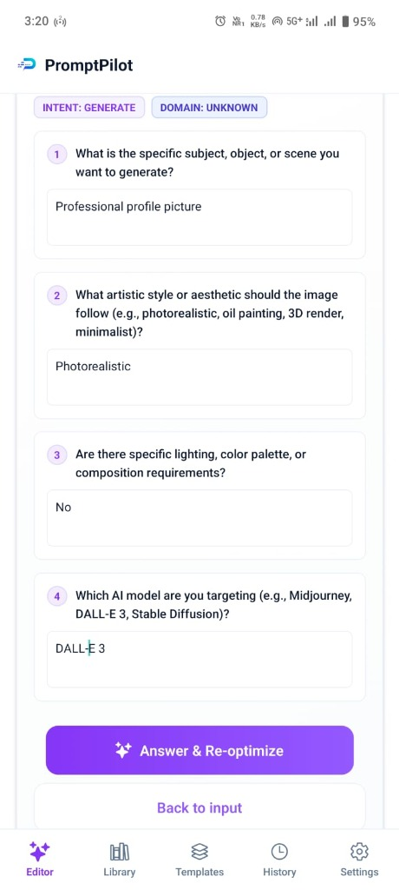
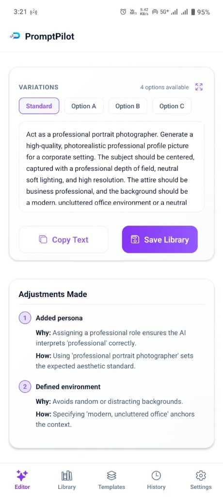
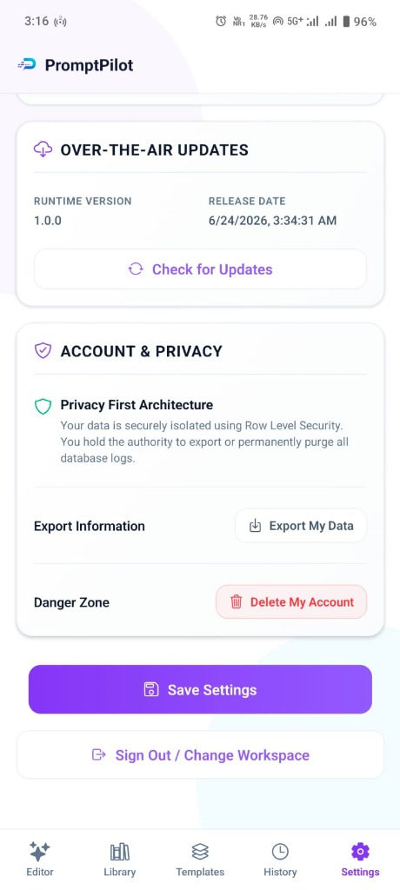

# PromptPilot Ecosystem

[](./web/README.md)
[](./extension/README.md)
[](./mobile/README.md)
[](https://supabase.com/)
[](./LICENSE)

> **A unified, multi-platform prompt engineering workspace and universal text optimization SaaS ecosystem. Features a centralized Web Workspace, a background-synced Manifest V3 Browser Extension, and a companion Expo Mobile Client with native Android system overlays.**

PromptPilot is designed to bridge the gap between prompt engineering and everyday text input fields on the web and mobile. Instead of forcing users to cycle between browser tabs, manually copy-paste drafts, and grade outputs by trial and error, PromptPilot injects AI optimization controls directly into their active writing contexts. The ecosystem shares a central Supabase PostgreSQL schema, JWT-based security layers, and an AI processing gateway, delivering a synchronized prompt library across all devices.

---

## 🚀 Engineering Highlights

- **Multi-Platform Architecture**: Engineered three distinct applications (Web, Extension, Mobile) operating on a single, synchronized database and API gateway.
- **Universal Browser Overlay**: Built a Chrome Manifest V3 extension utilizing **Plasmo** and scoped **Shadow DOM** boundaries, injecting AI rewrite elements on host inputs without style collision.
- **Android Platform Overlays**: Programmed a native Kotlin **Foreground Service** (`FloatingBubbleService`) for Android, mapping UI layouts directly via `WindowManager` overlays to run over third-party applications.
- **Secure Token Caching**: Isolated authentication tokens from plaintext client storage using hardware-backed Apple Keychain (iOS) and Android Keystore (AES-256) wrappers.
- **Centralized Edge Gateways**: Built Next.js App Router edge routes to orchestrate LLM requests (Gemini, Claude, OpenAI, OpenRouter), parse JSON grades, and verify user API key overrides.
- **Multi-Tenant Row-Level Security**: Secured all PostgreSQL tables utilizing Supabase Row-Level Security (RLS) policies, binding query scopes directly to the active JWT.

---

## 👨‍💻 Engineering Ownership

This repository represents full end-to-end technical implementation and product design ownership:
- **System Architecture**: Designed the data synchronization topology, shared authentication flows, and API proxy routing structures.
- **Frontend & Web Dashboard**: Developed the Next.js workspace, prompt editors, grade widgets, and template grids.
- **Browser Extension**: Built the Plasmo content scripts, message bus communication, and Shadow DOM container.
- **Mobile Development**: Programmed the React Native screens, Expo plugins, and native Kotlin service overlays.
- **Database & Auth Design**: Structured the Postgres tables, RLS security policies, soft-delete triggers, and auth linkages.
- **DevOps & Release Pipeline**: Configured Vercel deployments, EAS cloud builds, and OTA update distributions.

---

## 🌐 The PromptPilot Ecosystem

PromptPilot brings advanced LLM capabilities directly into the user's workspace, wherever they write:

```
                            ┌────────────────────────┐
                            │  PromptPilot Database  │
                            │      (Supabase DB)     │
                            └───────────┬────────────┘
                                        │
             ┌──────────────────────────┼──────────────────────────┐
             ▼                          ▼                          ▼
  ┌─────────────────────┐    ┌─────────────────────┐    ┌─────────────────────┐
  │   Web Dashboard     │    │  Browser Extension  │    │  Mobile Application │
  │    (Next.js)        │    │    (Manifest V3)    │    │   (React Native)    │
  ├─────────────────────┤    ├─────────────────────┤    ├─────────────────────┤
  │ Central Workspace & │    │ Scoped Shadow DOM   │    │ Native Kotlin       │
  │ Preset templates    │    │ Overlay on host inputs│  │ WindowManager widget│
  └──────────┬──────────┘    └──────────┬──────────┘    └──────────┬──────────┘
             │                          │                          │
             └──────────────────────────┼──────────────────────────┘
                                        ▼
                            ┌────────────────────────┐
                            │    Next.js Edge API    │
                            │    (Secure Gateway)    │
                            └───────────┬────────────┘
                                        │
                           ┌────────────┴────────────┐
                           ▼            ▼            ▼
                      ┌─────────┐  ┌─────────┐  ┌─────────┐
                      │ Gemini  │  │ Claude  │  │ OpenAI  │
                      └─────────┘  └─────────┘  └─────────┘
```

---

## 📊 Ecosystem Snapshot

| Metric / Dimension | Web Platform | Browser Extension | Mobile Application |
| :--- | :--- | :--- | :--- |
| **Technology Stack** | Next.js 14, React 18, Tailwind | Plasmo, React 18, Tailwind | React Native, Expo 54, Kotlin |
| **Target OS / Platform** | All modern web browsers | Chromium browsers (Chrome, Edge) | Android (API 29+), iOS (17+) |
| **Local Security Cache** | HTTP-Only Cookies / Auth Session | `chrome.storage.local` (private) | `expo-secure-store` (Encrypted) |
| **Shared Auth Token** | Supabase Session (JWT) | Dashboard Session (postMessage) | Supabase OAuth / Token Sync |
| **Dynamic UI Injection** | Responsive dashboard pages | Scoped Shadow DOM container | Kotlin `WindowManager` overlays |
| **Operational State** | Real-time database sync | Background worker proxy | AsyncStorage replica cache |
| **OTA / Deployment** | Vercel Serverless deployments | Chrome Web Store MV3 | Expo EAS OTA Updates |

---

## 🏗️ High-Level Architecture

The ecosystem relies on Next.js Edge routing and Supabase security policies to process requests and sync states:



---

## 📚 Module Documentation

To inspect specific build steps, package structures, and implementation histories, select a module below:

### 🖥️ [Web Dashboard](./web/README.md)
* **Core Responsibilities**: Hosts the landing portal, preset workspace layouts, prompt history tables, and multi-tenant security layers.
* **Technology Stack**: Next.js 14, React, Tailwind CSS, Lucide icons, Supabase Auth.
* **Inspect Documentation**: [Go to `/web/README.md`](./web/README.md)

### 🧩 [Browser Extension](./extension/README.md)
* **Core Responsibilities**: Injects the floating rewrite triggers into web input fields, scopes CSS inside Shadow DOM elements, and proxies requests CORS-safely using service workers.
* **Technology Stack**: Plasmo, React, TypeScript, Manifest V3 background service workers, Shadow DOM interfaces.
* **Inspect Documentation**: [Go to `/extension/README.md`](./extension/README.md)

### 📱 [Mobile Companion](./mobile/README.md)
* **Core Responsibilities**: Caches workspace states offline, manages hardware keys, and compiles native Kotlin foreground services to draw widgets over third-party applications.
* **Technology Stack**: React Native, Expo SDK 54, custom Expo config plugins, Kotlin, AsyncStorage, Expo SecureStore.
* **Inspect Documentation**: [Go to `/mobile/README.md`](./mobile/README.md)

---

## 📸 Product Showcase

### 1. Web Platform Dashboard
The central hub for creating, managing, and auditing prompt assets. It features a grading workspace, preset template forms, database tables, and settings menus to update keys or queue account deletions.

| **Welcome & Auth Portal** | **Prompt Optimizer & Grading Workspace** |
| :---: | :---: |
|  |  |

| **Templates Preset Grid** | **Saved Workspace Settings & API Keys** |
| :---: | :---: |
|  |  |

### 2. Browser Extension UI
Overlay widgets injected directly next to input fields on any web page. It uses scoped shadow container isolation to bypass host page style rules, letting users process and insert text inline.

| **Extension - Popup Interface** | **Universal Inline Rewrite Panel** |
| :---: | :---: |
|  |  |

### 3. Mobile Companion Client
A responsive, tabbed workspace optimized for portable devices. It synchronizes template presets and prompt history, while drawing floating optimizer widgets on top of third-party applications on Android.

| **V2 Pipeline Questionnaire** | **Side-by-Side Variations & Grades** | **Workspace Settings Menu** |
| :---: | :---: | :---: |
|  |  |  |

---

## 🧠 Engineering Challenges Solved

Below is a summary of major engineering hurdles solved across the ecosystem. Deep-dive explanations are documented inside the respective module READMEs.

### 1. Scoped Shadow DOM Container Isolation (Browser Extension)
* **Problem**: Injected CSS stylesheets (such as Tailwind utilities) collide with the host page's styling, breaking either the extension UI or the host website's layout.
* **Solution**: Encapsulated the extension panel inside a **Shadow DOM root**. The Tailwind stylesheet is loaded only inside this shadow boundary, completely isolating the selectors.
* **Result**: Zero style pollution across major web environments (Gmail, Notion, Slack).

### 2. Same-Origin Bypass via Background Worker Proxy (Browser Extension)
* **Problem**: Host pages block direct fetch requests to the PromptPilot API gateway due to CORS and Same-Origin Policies.
* **Solution**: Routed all API operations to the extension's MV3 **background service worker** using Chrome's messaging bus. The worker executes requests in its own context, bypassing page CORS.
* **Result**: Zero CORS blocks across all host origins.

### 3. WindowManager Overlays & Foreground Restraints (Mobile)
* **Problem**: Drawing floating UI widgets on top of other running apps is restricted on modern Android systems (API 34+) to optimize memory and battery life.
* **Solution**: Engineered a Kotlin **Foreground Service** (`FloatingBubbleService`) drawing layouts via native `WindowManager` layout properties (`TYPE_APPLICATION_OVERLAY`) bound to persistent notification channels.
* **Result**: Safe, non-reaped background execution of overlay helper widgets.

### 4. Expo Kotlin Autolink Injection (Mobile)
* **Problem**: Incorporating native Kotlin classes inside Expo typically requires ejecting the workspace, breaking cloud compilations and EAS OTA updates.
* **Solution**: Developed a custom **Expo Config Plugin** (`withFloatingBubble.js`) that injects raw Kotlin files, modifies Gradle settings, and updates manifest files at compile time.
* **Result**: Maintained managed Expo compilation workflows without raw android directory duplication.

### 5. Multi-Tenant Row-Level Security Isolation (Backend)
* **Problem**: Monorepos accessing shared databases risk data exposure if authentication scopes are misconfigured.
* **Solution**: Configured Supabase Postgres Row-Level Security (RLS) policies targeting `auth.uid()`, binding data read/write commands to verified JWT payloads.
* **Result**: Secure, client-isolated transactions across all 3 platforms.

---

## ⭐ What Makes PromptPilot Different?

Unlike basic AI frontend wrappers, PromptPilot is built as a complete productivity infrastructure:
- **Bring-Your-Own-Key Design**: Users can securely override credentials in SecureStore, leveraging custom endpoints without platform markups.
- **True Multi-Platform Synchronization**: Text optimization histories and templates synchronize in real-time between Web, Mobile, and Extension using Postgres replication.
- **Side-by-Side Variations**: Generates multiple structured prompt options (Option A, B, C) rather than single outputs, providing a choice of writing styles.
- **Ecosystem-Wide Consistency**: The same grading logic (evaluating clarity, constraints, specificity, structure) governs all three platforms.

---

## 🛠️ Technology Stack Summary

```
   ┌────────────────────────────────────────────────────────┐
   │                    PromptPilot SaaS                    │
   └───────────────────────────┬────────────────────────────┘
                               │
       ┌───────────┬───────────┼───────────┬───────────┐
       ▼           ▼           ▼           ▼           ▼
  ┌─────────┐ ┌─────────┐ ┌─────────┐ ┌─────────┐ ┌─────────┐
  │Frontend │ │Backend  │ │Mobile   │ │Extension│ │Database │
  ├─────────┤ ├─────────┤ ├─────────┤ ├─────────┤ ├─────────┤
  │Next.js  │ │Next.js  │ │React    │ │Plasmo   │ │Postgres │
  │14       │ │Edge APIs│ │Native   │ │Framework│ │Supabase │
  │Tailwind │ │Supabase │ │Expo SDK │ │MV3      │ │RLS      │
  │React 18 │ │Auth     │ │Kotlin   │ │React 18 │ │Policies │
  └─────────┘ └─────────┘ └─────────┘ └─────────┘ └─────────┘
```

---

## 📂 Repository Structure

```text
PromptPilot (Workspace Root)
├── web/              # Next.js Web Platform Module
├── extension/        # Plasmo Browser Extension Module
├── mobile/           # React Native Expo Mobile Module
├── assets/           # Root documentation images and screenshots
└── supabase/         # Shared database schemas and migration files
```

---

## Why This Project Matters

PromptPilot represents a senior-level demonstration of full-stack ecosystem architecture:

- **Ecosystem Integration**: Builds three distinct, synchronized client architectures using a shared database.
- **Low-Level Native Engineering**: Integrates Kotlin services, Android overlays, and custom compile-time config plugins.
- **Robust Security Practices**: Applies hardware keychains, cryptographic Android Keystore packages, and multi-tenant RLS guards.
- **Modern Extension Architecture**: Implements Chrome Manifest V3 specifications, service worker proxies, and Shadow DOM container scopes.
- **Production DevOps**: Configures serverless edge functions, EAS update schedules, and real-time database replication.