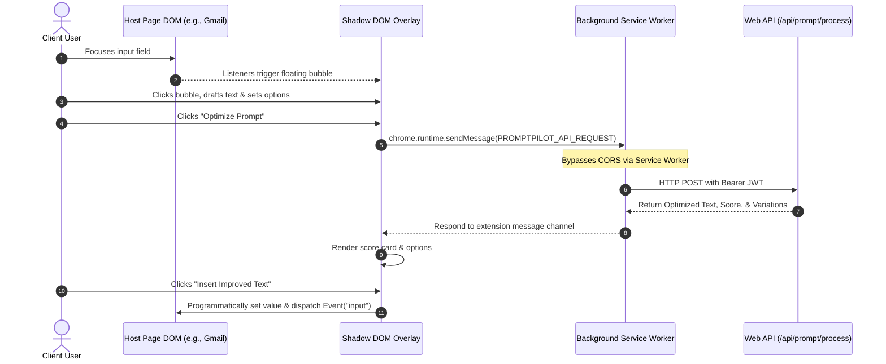

# PromptPilot Browser Extension

[](https://docs.plasmo.com/)
[](https://developer.chrome.com/docs/extensions/mv3/intro/)
[](https://react.dev/)
[](https://www.typescriptlang.org/)
[](https://tailwindcss.com/)

> **A production-grade, background-synced Chrome extension that injects universal AI rewriting, prompt optimization, and styling overlays directly into any text input field on the web.**

PromptPilot Extension brings advanced LLM capabilities directly into your daily web workflow. By overlaying an intuitive, draggable AI panel next to focused textareas and input fields, it eliminates the constant tab-switching and manual copy-pasting typical of prompt engineering. The extension operates as a downstream client of the central [PromptPilot Web Application](https://prompt-pilot-ochre.vercel.app), utilizing its secure API gateway, user configurations, and model providers.

---

## 📖 Table of Contents

1. [Product Walkthrough & Visual Proof](#-product-walkthrough--visual-proof)
2. [Key Features](#-key-features)
3. [Technical Stack](#-technical-stack)
4. [Deep-Dive Architecture & Security](#-deep-dive-architecture--security)
5. [How It Works](#-how-it-works)
6. [Getting Started & Installation](#-getting-started--installation)
7. [Production Build & Publishing](#-production-build--publishing)

---

## 📸 Product Walkthrough & Visual Proof

### 1. Secure Authentication Connection
The extension pop-up monitors auth state and confirms an **Active Connection** once synced with the Next.js web application. It displays the connected user's email, indicating the overlay panels are ready to write.
<p align="center">
  
</p>

### 2. Universal Inline Rewrite Panel
Whenever an input field or text area is focused, the PromptPilot action bubble appears. Clicking it triggers the overlay rewrite modal. Here, users can adjust optimization guidelines such as Tone (Professional, Casual, etc.), Length bounds, and LLM Platform specifications before processing.
<p align="center">
  
</p>

### 3. Real-time Variations & Optimization Scores
Upon executing rewrite or optimization pipelines, PromptPilot grades the prompt draft out of 100, displaying the original and improved versions side-by-side. Users can choose between multiple generated variation styles (Default, Option A, Option B, Option C) and insert the text directly into the page DOM in one click.
<p align="center">
  
</p>

---

## 🌟 Key Features

* **Real-Time Authentication Sync**: Listens to secure post-message events from the web dashboard domain to automatically sync login tokens and user configurations without manual input.
* **Draggable Floating Action Bubble**: A lightweight, non-obtrusive action trigger that follows focused inputs and textareas on any web page.
* **Universal Rewrite Panel Overlay**: An interactive modal panel that supports full customization:
  * **Tone Adjustments**: Toggles between *Professional, Casual, Friendly, Executive, Formal, and Persuasive*.
  * **Length Adjustments**: Instantly executes *Shorten, Expand, Summarize, and Simplify* operations.
  * **Platform Optimization**: Targets structural formatting for *ChatGPT (GPT-4o), Claude (Sonnet 3.5), and Gemini*.
* **Dynamic Variations Selector**: Render and toggle through multiple alternative prompt iterations generated by the LLM before committing.
* **Inline DOM Insertion**: Automatically updates the host page's input field with the chosen variation in one click, dispatching native input events to ensure compatibility with modern frameworks (React, Vue, etc.).
* **Minimized & Draggable UI**: The modal interface is fully movable and can be minimized to a compact toolbar, preserving the host page's layout.
* **State Hydration & Persistence**: Saves ongoing inputs, parameters, and current results to `chrome.storage.local` to survive page refreshes or tab switching.

---

## 🛠️ Technical Stack

* **Framework**: [Plasmo Framework](https://docs.plasmo.com/) (Manifest V3 template with React and TypeScript) for rapid development and clean builds.
* **Interface**: React functional components, hooks, and refs.
* **Styling**: Tailwind CSS for custom styling, packaged and isolated.
* **Icons**: [Lucide React](https://lucide.dev/) for high-resolution vector icons.
* **State & Storage**: Chrome Storage API (`chrome.storage.local`) for persisting user data and options.

---

## 📐 Deep-Dive Architecture & Security

To impress recruiters, this section breaks down the three core engineering challenges solved by PromptPilot's browser integration.



### 1. Style Isolation via Shadow DOM
* **Challenge**: Injecting a custom stylesheet (like Tailwind) into random third-party host pages can break their layout or, conversely, the host page's CSS rules can distort the extension's buttons.
* **Solution**: The extension constructs a Shadow DOM root container (`promptpilot-shadow-dom`) to house the modal components. By injecting the styles inside this isolated boundary, the UI is completely protected against parent document selector leaks.

### 2. Bypassing CORS via Background API Proxy
* **Challenge**: Standard browser Same-Origin Policies (SOP) block direct API requests from scripts running on host pages (e.g., Gmail, GitHub) to external APIs.
* **Solution**: Implemented an API Proxy Pattern. The content script delegates API communication to a background service worker using:
  ```typescript
  chrome.runtime.sendMessage({ type: "PROMPTPILOT_API_REQUEST", payload: { ... } });
  ```
  Since service workers execute out-of-context of the host page document, they bypass origin-level CORS constraints, forwarding requests safely to the serverless Edge gateway.

### 3. Cross-Domain Session Synchronization
* **Challenge**: Forcing users to type password credentials inside a tiny Chrome popup creates friction and security concerns.
* **Solution**: When a user logs into the web dashboard, a handshake is initiated. The dashboard broadcasts the session token via:
  ```javascript
  window.postMessage({ type: "PROMPTPILOT_SESSION", session }, "*");
  ```
  The extension's background listeners intercept this verified event and securely write the JWT to `chrome.storage.local`, establishing an instant passwordless bridge.

---

## 🚀 How It Works

1. **Detect Cursor**: As soon as a user clicks inside any `input`, `textarea`, or `contenteditable` container on a webpage, a floating **PromptPilot Sparkles Bubble** appears.
2. **Open Panel**: Clicking the bubble opens the **Universal Rewrite Panel** overlay.
3. **Configure Options**: The user's draft is loaded. Choose the desired tone (e.g., *Executive*), target length (e.g., *Expand*), and optimization engine (e.g., *Claude*).
4. **Trigger AI**: Clicks *Optimize Prompt* or *Rewrite Text*. The background proxy sends the payload to the Edge database orchestrator.
5. **Preview Variations**: The overlay displays the prompt's quality score alongside alternative variations.
6. **Apply and Insert**: The user selects their favorite variation and clicks *Insert Improved Text*. The extension programmatically populates the input field and triggers standard framework events.

---

## ⚙️ Getting Started & Installation

### Prerequisites
* Node.js v18+
* npm or pnpm

### 1. Install Dependencies
Clone the repository, navigate to the extension directory, and install the modules:
```bash
cd extension
npm install
```

### 2. Start the Development Server
Run the Plasmo live-reload service:
```bash
npm run dev
```

### 3. Load the Extension in Chrome
1. Open Google Chrome and navigate to `chrome://extensions/`.
2. Toggle on **Developer mode** in the top-right corner.
3. Click **Load unpacked** in the top-left corner.
4. Select the directory: `PromptPilot/extension/build/chrome-mv3-dev`.

*Note: Ensure the local Next.js web application is running at `http://localhost:3000` to handle authentications.*

---

## 📦 Production Build & Publishing

To package the browser extension for publication on the Chrome Web Store:

1. Generate the production build:
   ```bash
   npm run build
   ```
2. The compilation will produce a production-ready folder under:
   `PromptPilot/extension/build/chrome-mv3-prod`
3. Compress this folder into a `.zip` archive to submit it directly to the [Chrome Developer Dashboard](https://developer.chrome.com/docs/webstore/publish/).
