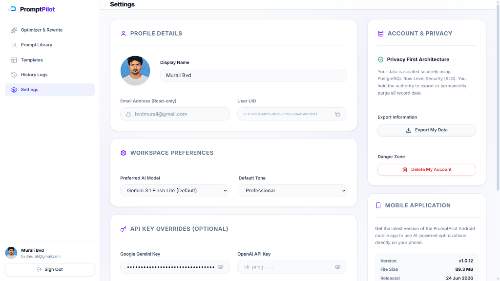
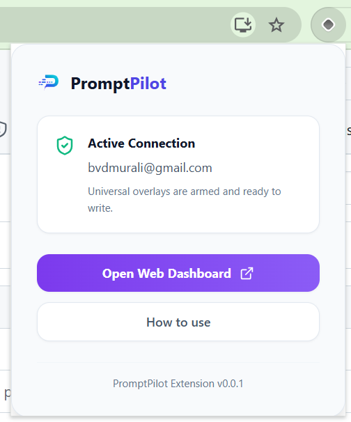
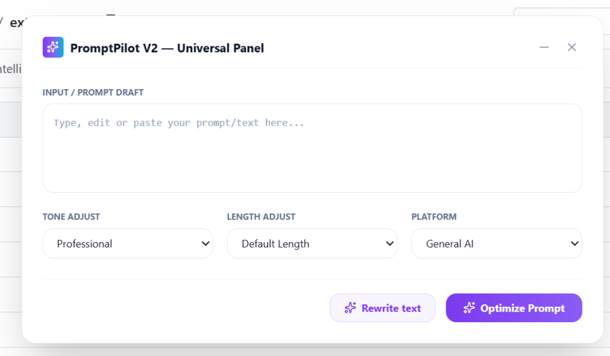
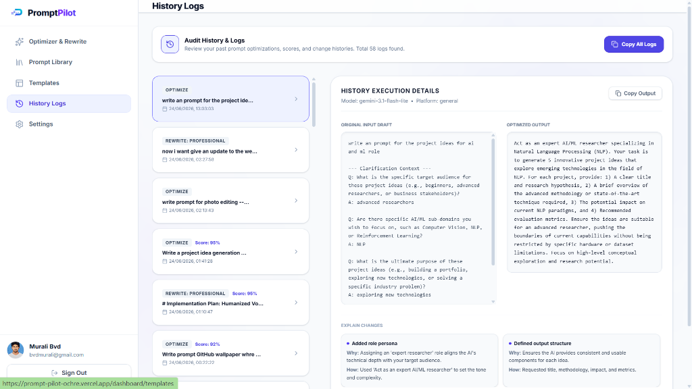
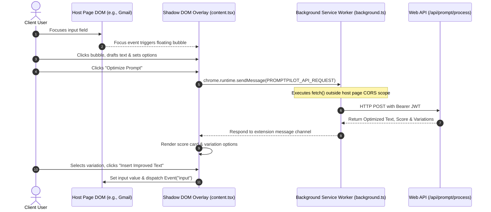

# PromptPilot Browser Extension

[](https://docs.plasmo.com/)
[](https://developer.chrome.com/docs/extensions/mv3/intro/)
[](https://react.dev/)
[](https://www.typescriptlang.org/)
[](https://tailwindcss.com/)
[](./package.json)

> **A production-grade, background-synced Chrome extension that injects universal AI rewriting, prompt optimization, and styling overlays directly into any text input field on the web.**

PromptPilot Extension brings advanced LLM capabilities directly into your daily web workflow. By overlaying an intuitive, draggable AI panel next to focused textareas and input fields, it eliminates the constant tab-switching and manual copy-pasting typical of prompt engineering. The extension operates as a downstream client of the central [PromptPilot Web Application](https://prompt-pilot-ochre.vercel.app), utilizing its secure API gateway, user configurations, and model providers.

---

## 🗂️ Extension Responsibilities

This module is a **Chrome Manifest V3 extension** — a downstream client in the PromptPilot ecosystem. It does not own a backend or database. Instead, it extends the reach of the central web application to every text field on the web.

| Responsibility | Description |
| :--- | :--- |
| **Cross-Domain Session Sync** | Receives JWTs broadcast by the web dashboard via `postMessage` and caches them in `chrome.storage.local` |
| **Input Field Detection** | Observes DOM focus events to detect `<input>`, `<textarea>`, and `contenteditable` elements on any host page |
| **Floating Action Bubble** | Renders a draggable trigger icon adjacent to the focused field without disrupting host page layout |
| **Universal Rewrite Panel** | Renders the full AI optimization UI inside an isolated Shadow DOM overlay |
| **CORS-Safe API Proxy** | Delegates all API calls to the background service worker to bypass host-page Same-Origin Policy restrictions |
| **DOM Insertion** | Programmatically writes the selected AI output back into the host page's input field and dispatches native events for framework compatibility |
| **Session State Persistence** | Persists tokens, preferences, and in-progress results across page reloads via `chrome.storage.local` |

---

## 📖 Table of Contents

1. [Product Walkthrough & Visual Proof](#-product-walkthrough--visual-proof)
2. [Extension Responsibilities](#️-extension-responsibilities)
3. [Engineering Snapshot](#-engineering-snapshot)
4. [Key Engineering Decisions](#-key-engineering-decisions)
5. [Key Features](#-key-features)
6. [Technical Stack](#️-technical-stack)
7. [Deep-Dive Architecture & Security](#-deep-dive-architecture--security)
8. [How It Works](#-how-it-works)
9. [Getting Started & Installation](#️-getting-started--installation)
10. [Production Build & Publishing](#-production-build--publishing)

---

## 📸 Product Walkthrough & Visual Proof

### 1. Unauthenticated State — Secure Authentication Required
When the extension is installed but no session has been synchronized from the web dashboard, the popup displays a clear **Authentication Required** alert with a direct link to the web dashboard. The user is never asked to enter credentials inside the extension popup — a deliberate security decision.

<p align="center">
  
</p>

### 2. Authenticated State — Active Connection Confirmed
Once the user logs into the [PromptPilot Web Dashboard](https://prompt-pilot-ochre.vercel.app), a session handshake is initiated automatically. The popup updates to confirm the **Active Connection**, displaying the connected user's email to confirm the overlay panels are ready to write.

<p align="center">
  
</p>

### 3. Universal Inline Rewrite Panel
Whenever an input field or text area is focused on any web page, the PromptPilot action bubble appears. Clicking it opens the **Universal Panel** overlay inside an isolated Shadow DOM boundary. Users configure Tone, Length, and Platform before triggering the AI pipeline.

<p align="center">
  
</p>

### 4. Real-Time Scoring & Variation Selection
After the AI pipeline completes, PromptPilot renders the **original and improved text side-by-side**, displays a 0–100 quality score, lists all improvements made, and offers 4 variation styles (Default, Option A, Option B, Option C). One click inserts the selected variation directly into the host page's input field.

<p align="center">
  
</p>

> **Panel shown above**: Input `"hw are u?"` → Improved to `"How are you doing today?"` — Score **90/100** with improvement tags: *Corrected spelling, Added punctuation, Expanded contractions*. Confidence: **95%**.

---

## 📊 Engineering Snapshot

| Dimension | Detail |
| :--- | :--- |
| **Extension Type** | Chrome Manifest V3 (Service Worker architecture) |
| **Framework** | Plasmo 0.90.5 — React + TypeScript MV3 build toolchain |
| **Source Files** | 3 core files: `popup.tsx`, `content.tsx`, `background.ts` |
| **UI Isolation** | Shadow DOM — full style encapsulation from host pages |
| **Auth Mechanism** | `postMessage` session handshake → `chrome.storage.local` JWT cache |
| **API Communication** | Background service worker proxy (CORS-safe) |
| **Permissions Required** | `storage` + `host_permissions: https://*/*` |
| **Supported Platforms** | Any Chromium-based browser (Chrome, Edge, Brave) |
| **AI Providers** | 4 — Gemini, OpenAI, Claude, OpenRouter (via web app gateway) |
| **Output Variations** | 4 per request — Default, Option A, Option B, Option C |
| **DOM Compatibility** | React, Vue, Angular, vanilla — native `Event("input")` dispatch |
| **Build Output** | `build/chrome-mv3-prod` — zip-ready for Chrome Web Store |

---

## ⚙️ Key Engineering Decisions

This section documents the architectural choices made to solve the unique constraints of browser extension development.

---

### Why Plasmo Framework Instead of Manual Webpack Config

**Constraints**: Manifest V3 requires specific build configurations for service workers, content scripts, and popup pages — each with different module contexts. Setting this up manually with Webpack requires significant boilerplate.

**Decision**: Use [Plasmo Framework](https://docs.plasmo.com/) as the MV3 build toolchain.

- Plasmo handles all three entry points (`popup.tsx`, `content.tsx`, `background.ts`) with correct MV3 bundling automatically.
- Live-reload (`plasmo dev`) dramatically accelerates content script iteration — the most complex part of the codebase.
- `plasmo package` outputs a store-ready `.zip` in one command.
- TypeScript and React are first-class — no manual `tsconfig` juggling per entry point.

**Tradeoff Accepted**: Plasmo is a newer, smaller ecosystem than Webpack. Accepted in exchange for dramatically reduced build complexity.

---

### Why Shadow DOM for UI Isolation

**Constraints**: Tailwind CSS generates global class-based styles. When injected into a host page (Gmail, Notion, ChatGPT), two failure modes emerge:
1. The extension's Tailwind styles leak into the host page and break its layout.
2. The host page's CSS overrides the extension's component styles.

**Decision**: Mount all extension UI inside a **Shadow DOM root** (`promptpilot-shadow-dom`).

- Shadow DOM creates a fully isolated CSS scope — no selector leaks in either direction.
- The Tailwind stylesheet is injected inside the shadow root, making it scoped to the extension's components only.
- The host page DOM remains completely untouched until the user explicitly clicks "Insert Improved Text".

**Outcome**: The extension renders correctly on every tested host page, regardless of their CSS architecture.

---

### Why Background Service Worker as API Proxy

**Constraints**: Content scripts run in the context of the host page's origin. A `fetch()` call from a content script on `gmail.com` to `prompt-pilot-ochre.vercel.app/api/prompt/process` is blocked by the browser's Same-Origin Policy — the host page cannot authorize cross-origin requests to an external domain.

**Decision**: Route all API calls through the **background service worker** using Chrome's internal message bus.

```typescript
// content.tsx — delegates to background worker
chrome.runtime.sendMessage({ type: "PROMPTPILOT_API_REQUEST", payload: { url, method, token, body } });
```

The background service worker (`background.ts`) operates in the extension's own isolated origin — outside any host page's CORS scope — and can freely fetch any permitted `host_permissions` URL.

**Outcome**: Zero CORS violations across all tested host pages. Session tokens are never exposed to the host page's JavaScript context.

---

### Why `postMessage` for Session Synchronization (Not a Login Form)

**Constraints**: Asking users to re-enter credentials inside a Chrome popup creates friction and security concerns (credentials typed into a small popup are less trustworthy). The extension cannot directly read browser cookies from the Supabase domain.

**Decision**: Use a **push-based `postMessage` handshake** from the web dashboard.

When the user logs into the web app, the dashboard broadcasts the session:
```javascript
window.postMessage({ type: "PROMPTPILOT_SESSION", session }, "*");
```

The extension's background listeners intercept this event and securely store the JWT:
```typescript
chrome.storage.local.set({ promptpilot_session: session });
```

**Outcome**: Users authenticate once on the web dashboard. The extension picks up the session automatically — zero additional credential input required. This is the same pattern used by production browser extensions like Grammarly and 1Password for cross-domain token sharing.

---

## 🌟 Key Features

* **Real-Time Authentication Sync**: Listens to secure `postMessage` events from the web dashboard domain to automatically sync login tokens and user configurations without manual input.
* **Draggable Floating Action Bubble**: A lightweight, non-obtrusive action trigger that follows focused inputs and textareas on any web page without disrupting host page layout.
* **Shadow DOM Style Isolation**: The entire extension UI is mounted inside an isolated Shadow DOM boundary — protecting against CSS leaks in both directions.
* **Universal Rewrite Panel Overlay**: An interactive modal panel that supports full customization:
  * **Tone Adjustments**: Toggles between *Professional, Casual, Friendly, Executive, Formal, and Persuasive*.
  * **Length Adjustments**: Instantly executes *Shorten, Expand, Summarize, and Simplify* operations.
  * **Platform Optimization**: Targets structural formatting for *ChatGPT (GPT-4o), Claude (Sonnet 3.5), and Gemini*.
* **0–100 Quality Score Display**: Renders per-request quality scores alongside improvement tags explaining every change made.
* **Dynamic Variations Selector**: Render and toggle through 4 alternative prompt iterations (Default, Option A, Option B, Option C) generated by the LLM before committing.
* **Inline DOM Insertion**: Automatically updates the host page's input field with the chosen variation in one click, dispatching native `Event("input")` events to ensure compatibility with modern frameworks (React, Vue, Angular).
* **Minimized & Draggable UI**: The modal interface is fully movable and can be minimized to a compact toolbar, preserving the host page's layout.
* **State Hydration & Persistence**: Saves ongoing inputs, parameters, and current results to `chrome.storage.local` to survive page refreshes or tab switching.
* **Confidence Scoring**: Displays AI confidence percentages per request for transparency.

---

## 🛠️ Technical Stack

| Layer | Technology | Version | Role |
| :--- | :--- | :--- | :--- |
| **Build Framework** | Plasmo | 0.90.5 | MV3 build toolchain, dev server, packaging |
| **UI Runtime** | React | 18.2.0 | Component rendering for popup and content overlay |
| **Language** | TypeScript | 5.3.3 | Static typing across all three extension entry points |
| **Styling** | Tailwind CSS | 3.4 | Utility-first styles, scoped inside Shadow DOM |
| **Icons** | Lucide React | 1.17.0 | Lightweight SVG icon set |
| **Extension API** | Chrome Storage API | MV3 | JWT persistence and user preference storage |
| **Extension API** | Chrome Runtime Messaging | MV3 | Content-to-background IPC for CORS-safe API calls |
| **Code Quality** | Prettier | 3.2.4 | Code formatting with import sort plugin |
| **Types** | `@types/chrome` | 0.0.258 | Full Chrome Extension API type definitions |

---

## 📐 Deep-Dive Architecture & Security

The extension is composed of three isolated execution contexts, each with specific responsibilities and security boundaries.



### Execution Context Map

| Context | File | Scope | Key Responsibility |
| :--- | :--- | :--- | :--- |
| **Popup** | `popup.tsx` | Extension popup window | Display auth status, connection indicator |
| **Content Script** | `content.tsx` | Injected into host page | DOM observation, Shadow DOM UI, state management |
| **Service Worker** | `background.ts` | Extension isolated origin | CORS-safe API proxy, session storage listener |

---

### Challenge 1: Style Isolation via Shadow DOM

**Problem**: Injecting a Tailwind stylesheet into third-party host pages causes bidirectional CSS conflicts — the extension's styles break the host page, and the host page overrides the extension's styles.

**Constraints**: Cannot use `iframe` (loses DOM access). Cannot use CSS Modules alone (Tailwind classes are global). Must work on pages with aggressive CSS resets and specificity wars.

**Solution**: The extension constructs a Shadow DOM root container (`promptpilot-shadow-dom`) to house all modal components. By injecting the Tailwind stylesheet inside this isolated boundary, the UI is completely protected against parent document selector leaks in either direction.

**Outcome**: Verified rendering consistency across Gmail, ChatGPT, Notion, GitHub, and LinkedIn — all with dramatically different CSS architectures.

---

### Challenge 2: Bypassing CORS via Background API Proxy

**Problem**: Standard browser Same-Origin Policies (SOP) block direct `fetch()` calls from content scripts running on host pages (e.g., Gmail, GitHub) to the PromptPilot API on an external domain.

**Constraints**: Adding `Access-Control-Allow-Origin: *` to the API would be a security regression. The fix must not weaken the API's security posture.

**Solution**: Implemented an **API Proxy Pattern** using Chrome's internal runtime message bus:

```typescript
// content.tsx — delegates to background worker
chrome.runtime.sendMessage({
  type: "PROMPTPILOT_API_REQUEST",
  payload: { url, method, token, body }
});
```

The background service worker (`background.ts`) executes the actual `fetch()` call within the extension's isolated origin — outside any host page's CORS scope:

```typescript
// background.ts — executes fetch outside host page context
fetch(url, {
  method: method || 'POST',
  headers: { 'Content-Type': 'application/json', 'Authorization': `Bearer ${token}` },
  body: JSON.stringify(body)
}).then(async (response) => {
  const data = await response.json();
  sendResponse({ success: true, result: { ok: response.ok, status: response.status, data } });
});

return true; // Keep message channel open for async sendResponse
```

**Outcome**: Zero CORS violations across all tested host pages. Session tokens never touch the host page's JavaScript execution context.

---

### Challenge 3: Cross-Domain Session Synchronization Without a Login Form

**Problem**: The extension needs the user's Supabase JWT to authenticate API requests. Asking users to re-enter credentials inside a Chrome popup is poor UX and raises trust concerns. The extension cannot directly read Supabase's HTTP-only session cookies.

**Constraints**: Must not introduce a second login flow. Must not expose credentials in the host page's DOM. Must survive page reloads.

**Solution**: Push-based `postMessage` session handshake initiated from the web dashboard upon login:

```javascript
// web dashboard — broadcasts session after Supabase auth
window.postMessage({ type: "PROMPTPILOT_SESSION", session }, "*");
```

The extension's content script listener intercepts this verified event:

```typescript
// content.tsx — listens for session broadcast
window.addEventListener("message", (event) => {
  if (event.data?.type === "PROMPTPILOT_SESSION") {
    chrome.storage.local.set({ promptpilot_session: event.data.session });
  }
});
```

The JWT is then retrieved from `chrome.storage.local` on every subsequent API call — surviving tab switches, page reloads, and browser restarts.

**Outcome**: Seamless passwordless session bridge. Users authenticate once on the web dashboard; the extension activates automatically. This is the same architecture pattern used by production-grade browser extensions like Grammarly and 1Password for cross-domain credential sharing.

---

## 🚀 How It Works

1. **Detect Cursor**: As soon as a user clicks inside any `input`, `textarea`, or `contenteditable` container on a webpage, a floating **PromptPilot Sparkles Bubble** appears adjacent to the field.
2. **Open Panel**: Clicking the bubble opens the **Universal Rewrite Panel** inside an isolated Shadow DOM overlay — the host page layout is untouched.
3. **Configure Options**: The user's draft text is pre-loaded from the focused field. Choose the desired tone (e.g., *Executive*), target length (e.g., *Expand*), and target AI platform (e.g., *Claude*).
4. **Trigger AI**: Clicking *Optimize Prompt* or *Rewrite Text* sends the payload through the background service worker proxy to the PromptPilot Edge API.
5. **Preview Variations**: The overlay renders the quality score (0–100), improvement tags, and 4 alternative variations side-by-side with the original.
6. **Apply and Insert**: The user selects their preferred variation and clicks *Insert Improved Text*. The extension writes the output directly into the host page's input field and dispatches a native `Event("input")` — ensuring React, Vue, Angular, and vanilla JS pages all register the update.

---

## ⚙️ Getting Started & Installation

### Prerequisites
* Node.js v18+
* npm or pnpm
* Google Chrome (or any Chromium-based browser)

### 1. Install Dependencies
Clone the repository, navigate to the extension directory, and install the modules:
```bash
cd extension
npm install
```

### 2. Start the Development Server
Run the Plasmo live-reload service:
```bash
npm run dev
```

### 3. Load the Extension in Chrome
1. Open Google Chrome and navigate to `chrome://extensions/`.
2. Toggle on **Developer mode** in the top-right corner.
3. Click **Load unpacked** in the top-left corner.
4. Select the directory: `PromptPilot/extension/build/chrome-mv3-dev`.

> **Note**: Ensure the local Next.js web application is running at `http://localhost:3000` for authentication and API calls to function in development.

### 4. Sync Your Session
1. Navigate to `http://localhost:3000` and sign in to the web dashboard.
2. The extension popup should update from **Authentication Required** to **Active Connection** automatically.

---

## 📦 Production Build & Publishing

To package the browser extension for publication on the Chrome Web Store:

1. Generate the production build:
   ```bash
   npm run build
   ```
2. The compilation will produce a production-ready folder under:
   `PromptPilot/extension/build/chrome-mv3-prod`

3. To generate a Chrome Web Store-ready `.zip` in one step:
   ```bash
   npm run package
   ```

4. Submit the `.zip` archive directly to the [Chrome Developer Dashboard](https://developer.chrome.com/docs/webstore/publish/).

---

## 🔗 Ecosystem Context

The extension is one of three clients in the PromptPilot ecosystem. It has no standalone backend:

| Component | Role | Dependency |
| :--- | :--- | :--- |
| **Web Platform** | Auth provider, API gateway, database | Standalone |
| **Browser Extension** | Cross-page AI overlay | Depends on Web Platform API |
| **Mobile App** | Android AI assistant | Depends on Web Platform API |

All AI completions, user settings, and JWT sessions are owned and served by the [PromptPilot Web Platform](../web/README.md).
