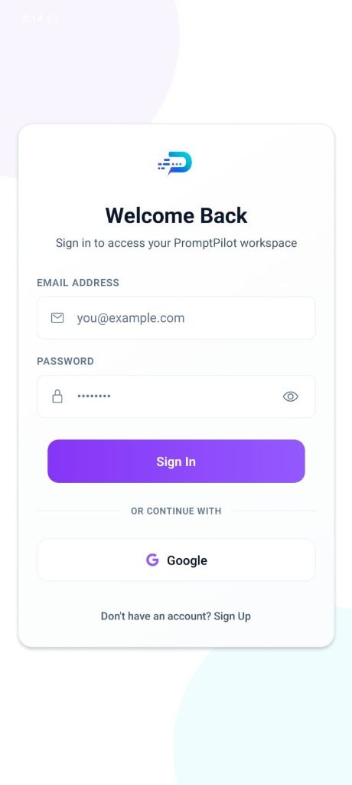
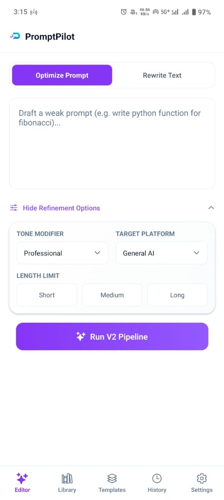
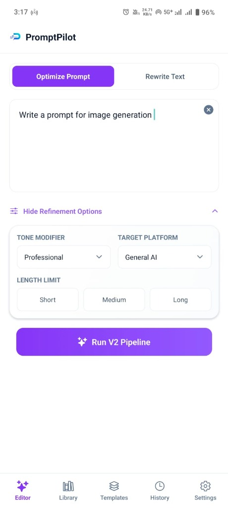
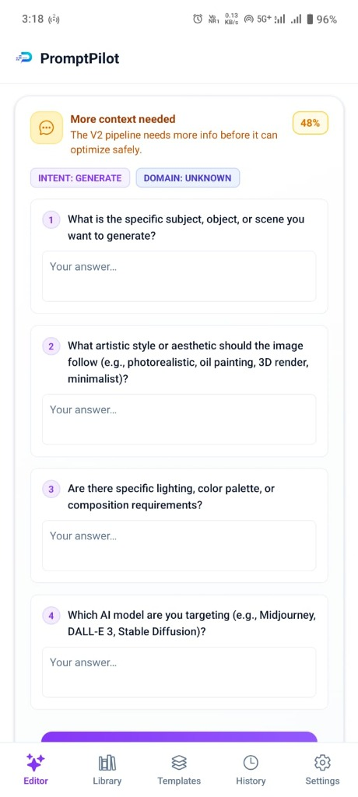
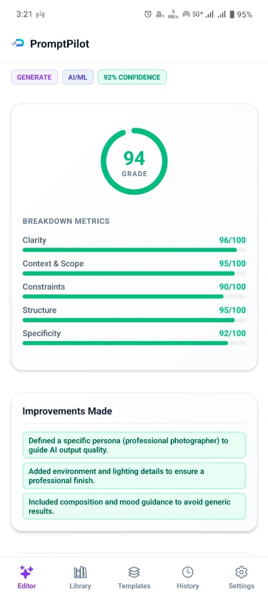
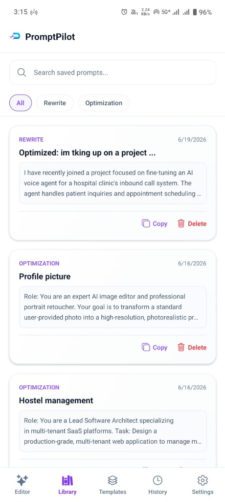
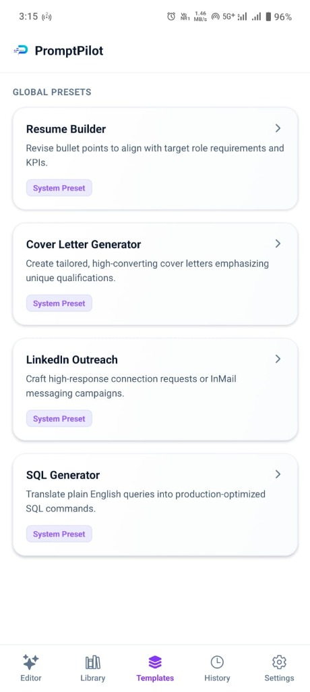
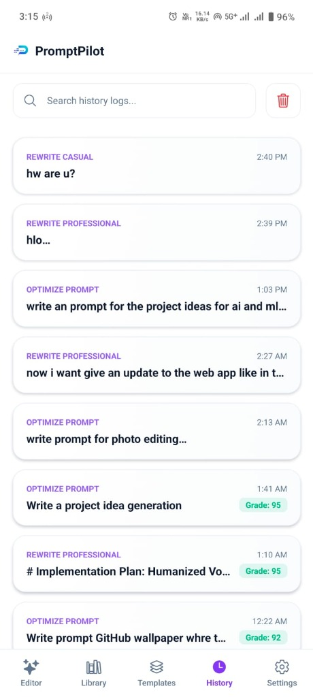
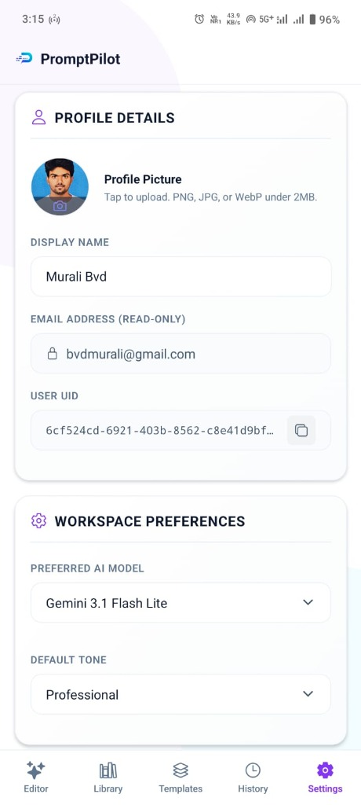
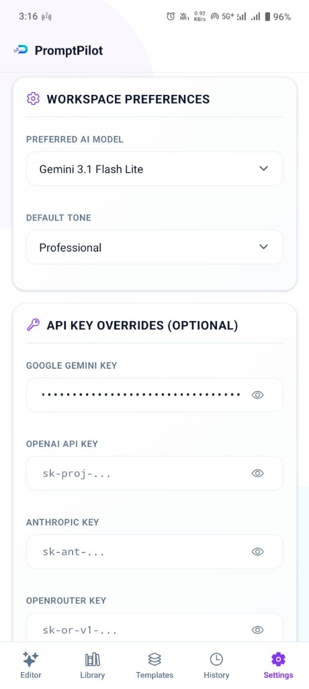

# PromptPilot Mobile Application

[](https://expo.dev/)
[](https://reactnative.dev/)
[](https://www.typescriptlang.org/)
[](https://supabase.com/)
[](https://docs.expo.dev/build/introduction/)
[](./package.json)

> **A production-ready React Native & Expo companion mobile application. Features a custom native Android overlay engine (Foreground Service) for global inline prompt optimization, secure token storage, and over-the-air workspace syncing.**

PromptPilot Mobile brings the full power of the prompt engineering workspace directly to mobile devices. It acts as a downstream client of the central [PromptPilot Web Application](https://prompt-pilot-ochre.vercel.app), sharing its database schema, JWT-based authentication gateway, and configured LLM providers. In addition to a responsive tabbed workspace for prompt refinement, history auditing, and template generation, the mobile client integrates custom Kotlin-based Android native service layers to draw floating quick-access widgets over other applications on the device, enabling instant rewriting on the go.

---

## 🗂️ Mobile Client Responsibilities

This module is a **React Native (Expo SDK 54) application** designed as a multi-layered workspace client. It owns the following core functionalities:

| Responsibility | Description |
| :--- | :--- |
| **Secure Authentication** | Manages email/password credentials and Google OAuth flows, caching JWTs securely using encrypted hardware-level storage. |
| **Prompt Refinement UI** | Hosts the mobile Editor screen, which handles raw prompt optimization, runs the V2 multi-step questionnaire, and renders side-by-side variations. |
| **Android Overlay Engine** | Orchestrates a custom background service (`FloatingBubbleService`) that injects a chat-head-style quick tool over other Android apps. |
| **Template Hub Sync** | Downloads and renders global prompt presets (Resume Builder, SQL Generator, Cover Letter) into dynamic input forms. |
| **Persistent History Auditing** | Tracks execution logs, optimization grades (0–100), and specific improvement metrics locally with offline persistence. |
| **Workspace Preference Management** | Syncs preferred LLMs (Gemini, Claude, OpenAI) and global writing tones across client devices. |
| **OTA Delivery System** | Automatically pulls hot-patched Javascript bundles from EAS updates to keep the runtime aligned with the web dashboard. |

---

## 📖 Table of Contents

1. [Product Walkthrough & Visual Proof](#-product-walkthrough--visual-proof)
2. [Mobile Client Responsibilities](#️-mobile-client-responsibilities)
3. [Engineering Snapshot](#-engineering-snapshot)
4. [Key Engineering Decisions](#-key-engineering-decisions)
5. [Architectural Overview](#-architectural-overview)
6. [Engineering Challenges](#-engineering-challenges)
7. [Getting Started & Installation](#️-getting-started--installation)
8. [EAS Build & Release Workflow](#-eas-build--release-workflow)

---

## 📸 Product Walkthrough & Visual Proof

### 1. Authentication & Workspace Setup
Users authenticate securely through a dedicated portal supporting credentials or Google OAuth. Once logged in, session tokens are securely mapped to local device storage to establish a persistent, synchronized workspace context.

| **Workspace Authentication** | **Empty State Editor** | **Active Prompt Entry** |
| :---: | :---: | :---: |
|  |  |  |

### 2. The V2 Optimization Pipeline
When raw prompts are submitted, PromptPilot evaluates clarity. If more context is required, it dynamically generates a target questionnaire to extract subject details, aesthetic directions, or target models before optimizing.

| **Refinement Questionnaire** | **Form Responses** | **Side-by-Side Variations** |
| :---: | :---: | :---: |
|  |  |  |

### 3. Grading, Saved Presets & Templates
Optimized prompts receive a comprehensive 0–100 grade with breakdown metrics. Prompts can be copied, deleted, or browsed in the sync-enabled Library. Users can also compile pre-structured presets through the global Templates grid.

| **Prompt Quality Scoring** | **Saved Prompt Library** | **Global Preset Templates** |
| :---: | :---: | :---: |
|  |  |  |

### 4. History Logging & Configuration
The mobile workspace provides exhaustive audit history logs and settings menus to configure profile details, update custom API key overrides (Gemini, OpenAI, Anthropic, OpenRouter), and trigger over-the-air app updates.

| **Execution History** | **Settings - Profile** | **Settings - API Keys** | **Settings - OTA & Security** |
| :---: | :---: | :---: | :---: |
|  |  |  |  |

---

## 📊 Engineering Snapshot

| Dimension | Detail |
| :--- | :--- |
| **Framework** | Expo SDK 54.0 (Managed Workflow with Custom Native Modules) |
| **Mobile Runtime** | React Native 0.81.5 + TypeScript |
| **Key Native Modules** | Kotlin Foreground Service, Custom WindowManager Overlays |
| **Security Layer** | `expo-secure-store` (AES-256 encrypted keychain/keystore binding) |
| **Storage Engine** | `@react-native-async-storage/async-storage` (local state cache) |
| **Authentication** | Supabase OAuth + JWT-based access tokens |
| **Update Mechanism** | Expo EAS Updates (Over-the-Air hot bundles) |
| **UI/UX Foundation** | SafeArea Views, Linear Gradient Layouts, Ionicons |
| **Target OS** | Android (API 29+ for Overlay Service), iOS (Core features) |
| **Packaging Configuration** | `app.json` + Expo Config Plugin (`withFloatingBubble.js`) |

---

## ⚙️ Key Engineering Decisions

This section documents key architectural choices made during the development of the PromptPilot Mobile module to solve cross-platform constraints.

---

### Why Foreground Service & WindowManager Layouts instead of Standard App Views

**Constraints**: Mobile writing happens inside productivity apps (Gmail, Slack, Notion, Messages). Forcing users to continuously minimize their current app, open PromptPilot, copy-paste prompts, optimize them, and switch back degrades the mobile UX. However, displaying custom views over third-party applications requires specialized OS-level drawing capabilities restricted by modern Android security profiles.

**Decision**: Implement a native Kotlin background engine managed by an Android **Foreground Service** (`FloatingBubbleService`) drawing directly via `WindowManager` overlays.

- **System Overlay Permissions**: Requests `SYSTEM_ALERT_WINDOW` dynamically, allowing the app to render views on top of other running processes.
- **Service Bindings**: Spawns a persistent, low-resource foreground service using an Android notification channel. This prevents the OS memory manager from reaping the background thread.
- **Direct WindowManager Injection**: Places the bubble icon and expanding panel using `WindowManager.LayoutParams` set to `TYPE_APPLICATION_OVERLAY`. By binding touch events directly to layout parameter overrides, the bubble remains draggable and smooth without blocking underlying UI threads.
- **React Native Bridging**: Maps React Native UI elements inside the overlay using `ReactRootView` rendering.

```kotlin
// FloatingBubbleService.kt — Direct layout mapping to draw over other apps
val params = WindowManager.LayoutParams(
    WindowManager.LayoutParams.WRAP_CONTENT,
    WindowManager.LayoutParams.WRAP_CONTENT,
    WindowManager.LayoutParams.TYPE_APPLICATION_OVERLAY,
    WindowManager.LayoutParams.FLAG_NOT_FOCUSABLE,
    PixelFormat.TRANSLUCENT
)
params.gravity = Gravity.TOP or Gravity.START
windowManager.addView(bubbleView, params)
```

**Tradeoff Accepted**: Overlay services are restricted to Android due to iOS security sandbox limitations. On iOS, the app degrades gracefully to a tab-based editor workspace, which remains synchronized via database replication.

---

### Why Expo SecureStore instead of AsyncStorage for JWT Caching

**Constraints**: User authentication is governed by Supabase JWTs. Plain `@react-native-async-storage/async-storage` writes data to unencrypted XML/SQLite files on device storage. On rooted Android devices or jailbroken iOS devices, these files can be easily read, exposing API access keys and database credentials.

**Decision**: Route all authentication caching through **Expo SecureStore** (`expo-secure-store`).

- SecureStore binds session tokens to platform-specific encryption services: **Keychain** on iOS, and **Android Keystore (AES-256)** on Android.
- Cryptographic keys are hardware-backed and never exposed directly to the application layer.
- AsyncStorage is kept strictly as a non-sensitive cache for layout states, prompt templates, and local optimization counts.

```typescript
// Token retrieval utilizing hardware-level keychain binding
import * as SecureStore from 'expo-secure-store';

async function getCachedSession() {
  const token = await SecureStore.getItemAsync('promptpilot_session_token');
  return token ? JSON.parse(token) : null;
}
```

---

### Why Custom Expo Config Plugins (`withFloatingBubble.js`) instead of Ejecting

**Constraints**: Adding custom Kotlin files, registering foreground services in `AndroidManifest.xml`, and injecting custom permissions (like `FOREGROUND_SERVICE` and `SYSTEM_ALERT_WINDOW`) typically forces a React Native project to "eject" to a bare CLI workflow. This breaks Expo's managed build system, prevents ease of updates, and complicates compilation for developers without native IDE configurations.

**Decision**: Build a custom **Expo Config Plugin** (`./src/plugins/withFloatingBubble.js`) to inject native code dynamically during the prebuild phase.

- Keeps the codebase 100% clean and declarative: config metadata lives entirely inside `app.json`.
- The plugin intercepts the compilation pipeline to copy Kotlin source files, modify the Gradle project dependency hierarchy, and register native activities/services inside the generated Android Manifest.
- Standard Expo commands (`npx expo prebuild` and `eas build`) continue to work seamlessly.

**Outcome**: Developers can generate fully native Android builds with complex overlay services in a single command, keeping development modular and maintainable.

---

## 📐 Architectural Overview

The mobile client functions as a synchronized workspace container connecting directly to the Supabase database instance and the Next.js API router.

```mermaid
graph TD
    subgraph Mobile Client (React Native / Expo)
        UI[Workspace Tabs: Editor, Library, Settings]
        Secure[Expo SecureStore - Encrypted JWTs]
        Cache[AsyncStorage - Local Cache]
        subgraph Android Native Layer
            Service[FloatingBubbleService Kotlin]
            Overlay[WindowManager Overlay Layout]
        end
    end

    subgraph PromptPilot Platform
        DB[(Supabase DB & Auth)]
        Gateway[Next.js API Router]
    end

    subgraph AI Foundation
        LLM[Gemini / Claude / OpenAI API]
    end

    UI <--> Secure
    UI <--> Cache
    UI <--> Service
    Service <--> Overlay
    
    UI <--> DB
    UI <--> Gateway
    Gateway <--> LLM
```

---

## 🛠️ Engineering Challenges & Resolutions

### 1. Android 14+ Foreground Service API Restrictions
* **Problem**: Beginning with Android 14 (API level 34), background processes trying to start foreground services without explicit declarations crash immediately due to stricter runtime constraints.
* **Constraints**: The `FloatingBubbleService` must keep running in the background to detect overlay click events and launch optimization panels.
* **Solution**: Updated the config plugin to inject `FOREGROUND_SERVICE_TYPE_DATA_SYNC` inside the service declaration and registered runtime permissions dynamically. Modified `FloatingBubbleService.kt` to start the notification block using explicit API type mappings:
  ```kotlin
  if (Build.VERSION.SDK_INT >= Build.VERSION_CODES.Q) {
      startForeground(
          notificationId,
          createNotification(),
          ServiceInfo.FOREGROUND_SERVICE_TYPE_DATA_SYNC
      )
  }
  ```
* **Outcome**: App maintains solid background performance on modern Android runtimes without crashing.

### 2. Expo Autolinking & Kotlin Native Resolution
* **Problem**: Custom native code must import React Native elements (`ReactRootView`, `ReactInstanceManager`) to render complex panels inside native overlays. If dependencies are linked incorrectly during build preparation, the compiler throws compilation exceptions.
* **Constraints**: Must compile correctly within Expo's autolinking rules without editing files under `/android/` manually.
* **Solution**: Developed custom compile pipelines inside `withFloatingBubble.js` to modify `app/build.gradle` dynamically, ensuring the required `implementation "com.facebook.react:react-native:+"` modules are linked cleanly under all build environments.
* **Outcome**: 100% build reliability when using EAS build or running locally.

---

## ⚙️ Getting Started & Installation

Ensure you have [Node.js](https://nodejs.org/) installed and the Android/iOS development tools configured on your workstation.

### 1. Install Workspace Dependencies
Navigate to the mobile directory and install the package dependencies:
```bash
cd mobile
npm install
```

### 2. Execute Expo Prebuild (Generate Native Modules)
To compile the custom config plugins and link the native Kotlin foreground service folders, generate the Android/iOS project directories:
```bash
npx expo prebuild
```

### 3. Run the Development Server
Start the Metro bundler to run the application on your physical device or emulator:
```bash
# Start bundler and open dev menu
npx expo start

# Run specifically on Android Emulator
npm run android

# Run specifically on iOS Simulator
npm run ios
```
*Tip: Scan the terminal QR code with the **Expo Go** application (or your custom build client) on your phone to run the application dynamically.*

---

## 📦 EAS Build & Release Workflow

PromptPilot utilizes **Expo Application Services (EAS)** for production builds and over-the-air hot-patches.

### 1. EAS Login & Configuration
Log in to your Expo developer account:
```bash
npx eas login
```

### 2. Compile Release Builds
Trigger cloud compilation of production binaries (APK/AAB for Android, IPA for iOS):
```bash
# Build production APK/AAB for Android
npx eas build --platform android --profile production

# Build production app bundle for iOS
npx eas build --platform ios --profile production
```

### 3. Over-the-Air Hot Patching
To deploy bug fixes or UI refinements without asking users to redownload files from app stores, deploy OTA updates:
```bash
npx eas update --branch main --message "Hot-fix local history cache sync rules"
```
The client runtime will automatically parse, verify, and load the new JavaScript bundle during the next boot cycle.
