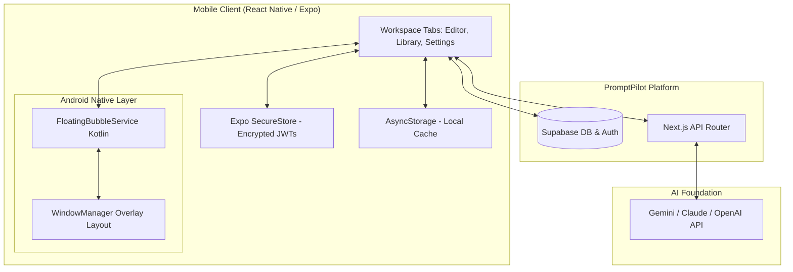
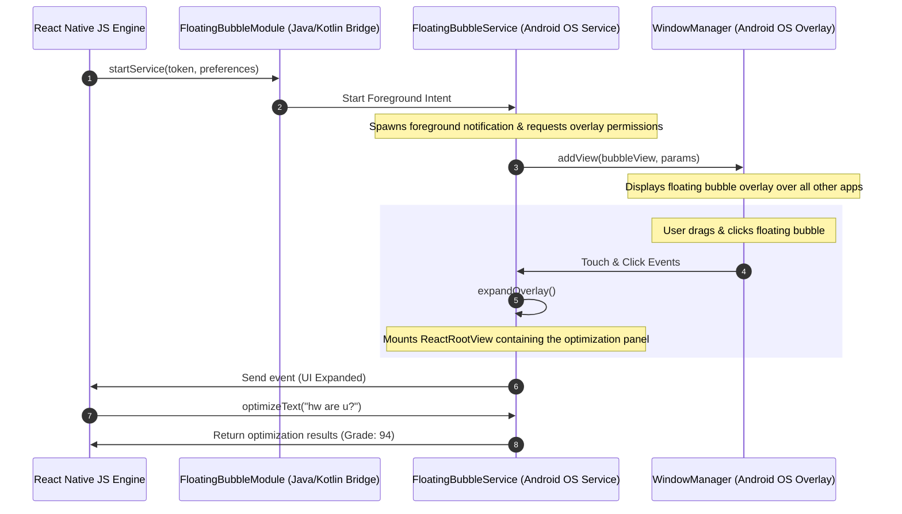

# PromptPilot Mobile Application

[](https://expo.dev/)
[](https://reactnative.dev/)
[](https://www.typescriptlang.org/)
[](https://supabase.com/)
[](https://docs.expo.dev/build/introduction/)
[](./package.json)

> **A production-grade, background-synced React Native & Expo companion mobile application. Features a custom native Android overlay engine (Kotlin Foreground Service) for system-wide inline prompt optimization, secure token storage, and over-the-air workspace syncing.**

PromptPilot Mobile brings the full power of the prompt engineering workspace directly to mobile devices. It operates as a downstream client in the PromptPilot ecosystem, sharing its database schema, JWT-based authentication gateway, and configured LLM providers. In addition to a responsive tabbed workspace for prompt refinement, history auditing, and template generation, the mobile client integrates custom Kotlin-based Android native service layers to draw floating quick-access widgets over third-party applications on the device, enabling instant rewriting on the go.

---

## 🚀 Engineering Highlights

- **Hybrid Native Architecture**: Engineered a bridge connecting React Native and native Android Kotlin services to deliver unified functionality.
- **System-Wide Overlay Engine**: Built a custom Android Foreground Service (`FloatingBubbleService`) that injects a chat-head-style quick tool over other Android apps via direct `WindowManager` overlay mapping.
- **Expo Config Plugin Toolchain**: Developed a custom build-time config plugin (`withFloatingBubble.js`) that injects Kotlin files, registers services, and requests system permissions at prebuild without ejecting the Expo managed workflow.
- **Encrypted Local Authentication**: Implemented secure session token caching utilizing Expo SecureStore, binding user credentials to hardware-level **Keychain** (iOS) and **Android Keystore (AES-256)**.
- **EAS Over-The-Air Infrastructure**: Configured EAS Update delivery pipelines to distribute Javascript patches directly to clients, bypassing app store review cycles.
- **Multi-Tab Workspace**: Designed a responsive tabbed UI (Editor, Library, Templates, History, Settings) backed by Supabase replication.

---

## 👨‍💻 Engineering Ownership

This module represents full end-to-end technical implementation and architectural ownership. The individual engineering contributions include:
- **Architecture Design**: Structured the React Native app lifecycle, navigation layers, and service boundaries.
- **Native Android Bridging**: Authored Kotlin packages to expose custom foreground services and intent broadcasts to the React Native JS runtime.
- **Build System Engineering**: Authored Expo Config Plugins (`withFloatingBubble.js`) using `@expo/config-plugins` to manipulate build-time Gradle profiles and the `AndroidManifest.xml`.
- **Security & Session Management**: Engineered secure session stores, JWT validation, and token refresh hooks.
- **UI/UX Implementation**: Developed a custom theme and styled components utilizing Expo Linear Gradient and Vector Icons.
- **Build & Release Automation**: Configured EAS credentials, `eas.json` profiles, and update branches.

---

## 🗂️ Mobile Client Responsibilities

The mobile client owns the downstream client responsibilities within the PromptPilot ecosystem:

| Responsibility | Description |
| :--- | :--- |
| **Secure Authentication** | Manages credentials and Google OAuth flows, caching JWTs securely using encrypted hardware-level storage. |
| **Prompt Refinement UI** | Hosts the mobile Editor screen, which handles raw prompt optimization, runs the V2 multi-step questionnaire, and renders side-by-side variations. |
| **Android Overlay Engine** | Orchestrates a custom background service (`FloatingBubbleService`) that injects a chat-head-style quick tool over other Android apps. |
| **Template Hub Sync** | Downloads and renders global prompt presets (Resume Builder, SQL Generator, Cover Letter) into dynamic input forms. |
| **Persistent History Auditing** | Tracks execution logs, optimization grades (0–100), and specific improvement metrics locally with offline persistence. |
| **Workspace Preference Management** | Syncs preferred LLMs (Gemini, Claude, OpenAI) and global writing tones across client devices. |
| **OTA Delivery System** | Automatically pulls hot-patched Javascript bundles from EAS updates to keep the runtime aligned with the web dashboard. |

---

## 📖 Table of Contents

1. [Product Walkthrough & Visual Proof](#-product-walkthrough--visual-proof)
2. [Mobile Client Responsibilities](#️-mobile-client-responsibilities)
3. [Engineering Snapshot & Platform Metrics](#-engineering-snapshot--platform-metrics)
4. [Key Engineering Decisions](#-key-engineering-decisions)
5. [Architectural Overview & Native Android Pipeline](#-architectural-overview--native-android-pipeline)
6. [Mobile Security Model](#-mobile-security-model)
7. [Performance & Reliability](#-performance--reliability)
8. [Engineering Challenges & Resolutions](#-engineering-challenges--resolutions)
9. [Getting Started & Installation](#️-getting-started--installation)
10. [EAS Build & Release Workflow](#-eas-build--release-workflow)
11. [Why This Project Matters](#why-this-project-matters)

---

## 📸 Product Walkthrough & Visual Proof

### 1. Authentication & Workspace Setup
Users authenticate securely through a dedicated portal supporting credentials or Google OAuth. Once logged in, session tokens are securely mapped to local device storage to establish a persistent, synchronized workspace context.

| **Workspace Authentication** | **Empty State Editor** | **Active Prompt Entry** |
| :---: | :---: | :---: |
|  |  |  |

### 2. The V2 Optimization Pipeline
When raw prompts are submitted, PromptPilot evaluates clarity. If more context is required, it dynamically generates a target questionnaire to extract subject details, aesthetic directions, or target models before optimizing.

| **Refinement Questionnaire** | **Form Responses** | **Side-by-Side Variations** |
| :---: | :---: | :---: |
|  |  |  |

### 3. Grading, Saved Presets & Templates
Optimized prompts receive a comprehensive 0–100 grade with breakdown metrics. Prompts can be copied, deleted, or browsed in the sync-enabled Library. Users can also compile pre-structured presets through the global Templates grid.

| **Prompt Quality Scoring** | **Saved Prompt Library** | **Global Preset Templates** |
| :---: | :---: | :---: |
|  |  |  |

### 4. History Logging & Configuration
The mobile workspace provides exhaustive audit history logs and settings menus to configure profile details, update custom API key overrides (Gemini, OpenAI, Anthropic, OpenRouter), and trigger over-the-air app updates.

| **Execution History** | **Settings - Profile** | **Settings - API Keys** | **Settings - OTA & Security** |
| :---: | :---: | :---: | :---: |
|  |  |  |  |

---

## 📊 Engineering Snapshot & Platform Metrics

| Metric / Dimension | Detail |
| :--- | :--- |
| **Workspace Architecture** | React Native (Expo SDK 54.0 Managed Workflow) |
| **Development Language** | TypeScript (UI/Business Logic), Kotlin (Native Android Overlay) |
| **Visual Architecture** | 6 Production Screens (`Auth`, `Editor`, `Templates`, `Library`, `History`, `Settings`) |
| **AI Processing Gateway** | Multi-Provider API client (Gemini, Claude, OpenAI, OpenRouter) |
| **User Authentication** | Supabase Auth (JWT credentials + dynamic Google OAuth linking) |
| **Local Storage Engine** | `@react-native-async-storage/async-storage` (local state replication) |
| **OTA Update Channel** | Expo EAS Updates (automated background download + check on boot) |
| **Encrypted Security Layer** | `expo-secure-store` (bound to Android Keystore / iOS Keychain) |
| **Android Background Engine** | Foreground Service (`FloatingBubbleService`), Notification Channel, Intent Filter |
| **Build Configuration** | `app.json` + Expo Config Plugin (`withFloatingBubble.js`) |
| **Testing Targets** | Android Emulator (API 29–34), iOS Simulator (API 17+), Physical Pixel devices |

---

## ⚙️ Key Engineering Decisions

---

### 1. Foreground Service & WindowManager Layouts for Inline System-Wide Optimization

**Problem**: Prompt optimization on mobile is highly context-dependent. If users must continuously switch back and forth between PromptPilot and editing apps (Gmail, Slack, Notion) to refine their text drafts, the UX becomes inefficient. 

**Constraints**: In modern versions of Android, launching a full UI activity from the background is heavily restricted due to performance and security protocols. Any overlay widget must run smoothly, draw on top of third-party apps, handle touch and drag guestures without blocking the underlying UI, and remain active in the background.

**Alternatives Considered**:
- **Android Input Method (Custom Keyboard)**: Building a custom soft-keyboard with AI capabilities. *Rejected*: Developing a full input method requires massive boilerplate, is difficult to align with custom UI designs, and degrades standard user typing experiences.
- **Standard App Switching**: Relying entirely on deep links and clipboard listeners. *Rejected*: Clipboards are highly sandboxed in modern operating systems, triggering user warnings and creating a disjointed user journey.

**Decision**: Implement a native Kotlin background service managed by an Android **Foreground Service** (`FloatingBubbleService`) that maps UI layouts directly using the platform's `WindowManager`.

- Spawns a persistent foreground service with a low-priority notification channel.
- Requests the `SYSTEM_ALERT_WINDOW` permission dynamically.
- Injects a bubble layout using `WindowManager.LayoutParams` set to `TYPE_APPLICATION_OVERLAY`.
- Employs a custom touch listener to compute dragging offsets relative to raw screen coordinates.

**Tradeoffs**:
- **Platform Fragmentation**: WindowManager overlays are exclusive to Android due to iOS sandbox security rules. On iOS, the application falls back gracefully to standard tab navigation.
- **System Overhead**: Running a foreground service requires a visible notification, consuming minor system resources.

**Outcome**: Users can drag, expand, and utilize the full V2 pipeline directly over any other Android application, bypassing clipboard barriers.

---

### 2. Expo SecureStore for JWT Caching

**Problem**: The application communicates with Next.js edge API gateways using Supabase JWT access tokens. If these tokens are compromised, third parties can perform authenticated API requests under the user's quota.

**Constraints**: Local data must persist across app lifecycles. Standard storage frameworks must be secure and resistant to system inspection.

**Alternatives Considered**:
- **AsyncStorage**: Standard React Native key-value store. *Rejected*: Stores data in unencrypted text files on device storage, making it readable on rooted devices.
- **SQLite Database**: Embedding a local SQL database. *Rejected*: Adds unnecessary package weight and configuration overhead for simple token caching.

**Decision**: Cache session tokens using **Expo SecureStore** (`expo-secure-store`).

- SecureStore maps keys to hardware-level secure storage: **Keychain** on iOS, and the **Android Keystore (AES-256)** on Android.
- Cryptographic keys are hardware-backed and never exposed directly to the application layer.

**Tradeoffs**:
- **Storage Limits**: SecureStore is limited to values of 2048 bytes or less. This is sufficient for JWTs but rules out caching large JSON histories. Large histories are kept in AsyncStorage, which does not contain sensitive credentials.

**Outcome**: Robust protection of user authentication states, satisfying corporate mobile security standards.

---

### 3. Custom Expo Config Plugins for Native Kotlin Extensions

**Problem**: The mobile app's core value proposition depends on custom Kotlin code, custom background services, and Android Manifest declarations. Standard Expo workflows do not support arbitrary native compilation without "ejecting" to a bare React Native project.

**Constraints**: Ejecting removes the ease of Expo CLI commands, complicates dependency upgrades, and prevents automated cloud bundling via EAS Build.

**Alternatives Considered**:
- **Ejecting to Bare Workflow**: Generating native `/android` and `/ios` folders permanently. *Rejected*: Significantly increases repository maintenance overhead and loses Expo managed upgrades.
- **Expo Prebuild & Manual Patches**: Running prebuild and applying git patches. *Rejected*: Fragile, error-prone, and breaks automated EAS cloud builds.

**Decision**: Author a custom **Expo Config Plugin** (`./src/plugins/withFloatingBubble.js`) using `@expo/config-plugins` to inject Kotlin service code and manifest permissions dynamically during compile-time.

- Maps Kotlin files into the compiler's source path during the `npx expo prebuild` lifecycle.
- Inserts required permissions and `<service>` blocks into the `AndroidManifest.xml` via JS-to-XML transform rules.
- Appends gradle package linkages dynamically to `app/build.gradle`.

**Tradeoffs**:
- **Debug Overhead**: Debugging config plugins requires understanding Expo's internal build hook lifecycle, increasing development complexity.

**Outcome**: Maintained Expo's managed workflow, enabling cloud-based EAS compilation and seamless OTA updates while incorporating custom native Kotlin service libraries.

---

## 📐 Architectural Overview & Native Android Pipeline

The mobile client is designed around a modular layer structure, keeping the React Native Javascript runtime isolated from native Android execution contexts, while communicating via a unidirectional Bridge protocol.



### Native Android Architecture & Bridging Pipeline



---

## 🔒 Mobile Security Model

PromptPilot Mobile enforces high-grade security practices to protect user data, API endpoints, and platform credentials.

```
                  ┌────────────────────────────────────────┐
                  │          PromptPilot Mobile            │
                  └───────────────────┬────────────────────┘
                                      │
             ┌────────────────────────┴────────────────────────┐
             ▼                                                 ▼
  ┌──────────────────────┐                          ┌──────────────────────┐
  │ Sensitive Keys & JWT │                          │ Non-Sensitive State  │
  └──────────┬───────────┘                          └──────────┬───────────┘
             │                                                 │
             ▼ (Hardware Encryption)                           ▼ (Plain File Cache)
  ┌──────────────────────┐                          ┌──────────────────────┐
  │  Expo SecureStore    │                          │     AsyncStorage     │
  └──────────┬───────────┘                          └──────────────────────┘
             │
      ┌──────┴────────────────┐
      ▼                       ▼
┌───────────┐           ┌───────────┐
│ iOS       │           │ Android   │
│ Keychain  │           │ Keystore  │
└───────────┘           └───────────┘
```

### 1. Hardware-Backed Credential Isolation
Sensitive authentication payloads (tokens and refresh keys) are isolated from normal storage channels:
- **Keychain (iOS)**: Session tokens are stored inside the encrypted Apple Keychain.
- **Android Keystore**: Tokens are encrypted using AES-256 keys generated in the hardware-isolated Keystore.
- **Process Isolation**: The application utilizes React Native JS sandboxing, preventing raw javascript memory access from external apps.

### 2. Client-Side API Key Overrides
While default operations pass through the backend proxy gateway, users can override API keys (Gemini, Anthropic, OpenAI, OpenRouter) inside settings.
- **Local Encryption**: Overridden keys are immediately written to SecureStore rather than AsyncStorage.
- **Zero-Server-Retention**: Custom keys are passed inside the request headers to the backend proxy router. They are used for the duration of the request and are never stored in the database.

### 3. Server-Side Execution of Sensitive Operations
To protect the backend logic:
- Mobile clients do not execute raw LLM calls. All optimization logic is processed on Next.js edge API gateways.
- Database access is restricted via Supabase Row-Level Security (RLS) tables. Mobile clients authenticate requests using JWT headers, preventing unauthorized access.

### 4. Secure OTA Bundle Verification
Expo EAS Updates use secure HTTPS transport to fetch new bundles. Code signatures are validated locally before reloading the metro package, preventing man-in-the-middle code execution.

---

## ⚡ Performance & Reliability

PromptPilot Mobile is optimized to run smoothly on standard mobile hardware.

### 1. Overlay Memory Management & View Recycler
Rendering a React Native application inside a system-level overlay can consume significant memory.
- **Recycling Root Views**: When the overlay is collapsed, `reactRootView` is unmounted from the window manager, freeing up GPU layers.
- **Single Instance lifecycle**: The service keeps only a single instance of `ReactInstanceManager` active. This avoids launching a second Javascript execution engine, keeping memory usage low.

### 2. Foreground Service Lifecycle Controls
Android aggressively terminates background services to conserve battery.
- **Persistent Notification Binding**: The foreground service binds to an active system notification, indicating to the system that the service is running.
- **Auto-Restart Action**: Service intent configurations are marked `START_STICKY`, instructing the OS to recreate the service automatically if it is reaped under extreme memory pressure.

### 3. Caching & Network Optimization
- **Deduplication**: Frequent network requests are batched. Tab state loads use optimistic local updates while verifying with the remote database.
- **Image Optimizations**: Icons and profile pictures are compressed and cached locally via memory wrappers to avoid layout shifting.

---

## 🛠️ Engineering Challenges & Resolutions

---

### 1. Android 14+ Foreground Service API Restrictions

**Problem**: Starting with Android 14 (API Level 34), foreground services that do not declare their specific type inside `AndroidManifest.xml` will crash immediately at runtime due to new OS security regulations.

**Constraints**:
- The `FloatingBubbleService` must operate in the background to handle overlay gesture events.
- It must run inside Expo's managed compile flow.

**Alternatives Considered**:
- **Standard Background Service**: Running without foreground bindings. *Rejected*: The Android OS terminates background services within minutes of the app being closed, making overlays unreliable.
- **Ejecting and Hardcoding Manifest**: *Rejected*: Ejecting breaks the EAS build pipeline.

**Solution**: Configured the build plugin to write `FOREGROUND_SERVICE_TYPE_DATA_SYNC` inside the service declaration and registered permission flags dynamically. Updated `FloatingBubbleService.kt` to bind the notification wrapper using explicit API check guards:

```kotlin
// Specifying foregroundServiceType dynamically to avoid crashes on API 34+
if (Build.VERSION.SDK_INT >= Build.VERSION_CODES.Q) {
    startForeground(
        notificationId,
        createNotification(),
        ServiceInfo.FOREGROUND_SERVICE_TYPE_DATA_SYNC
    )
} else {
    startForeground(notificationId, createNotification())
}
```

**Tradeoffs**:
- Requires declaring `DATA_SYNC` permission inside Google Play console reviews.

**Outcome**: PromptPilot Mobile maintains background service stability on Android 14+ devices without runtime crashes.

---

### 2. Multi-Context React Native Rendering in Kotlin Overlays

**Problem**: The Kotlin foreground service must render the PromptPilot optimization overlay on top of other apps. However, rendering a React Native view outside the main React Activity context causes rendering failures and dependency exceptions.

**Constraints**:
- The overlay view must preserve Javascript state connection hooks.
- It must share the metro bundler runtime instance with the main application.

**Alternatives Considered**:
- **Native Android XML Layouts**: Coding the overlay panel entirely in Kotlin XML views. *Rejected*: Requires duplicating the prompt optimization, scoring, and editing UI in native Kotlin, which defeats the purpose of React Native and increases code maintenance.
- **WebViews in Overlays**: Loading a local HTML file inside a system WebView. *Rejected*: High memory usage, slow load times, and poor styling integration.

**Solution**: Implemented a custom `ReactRootView` mounting wrapper inside `FloatingBubbleService.kt` that links to the shared `ReactInstanceManager`.

```kotlin
// Mount React Native component dynamically inside native overlay FrameLayout
val reactApplication = application as ReactApplication
val reactInstanceManager = reactApplication.reactNativeHost.reactInstanceManager

reactRootView = ReactRootView(this).apply {
    startReactApplication(
        reactInstanceManager,
        "promptpilot-overlay", // Registered entry point in index.js
        null
    )
}
overlayView?.addView(reactRootView)
```

**Tradeoffs**:
- The overlay bundle must be registered in the application's root registry, requiring a separate entry point (`promptpilot-overlay`).

**Outcome**: High-fidelity, responsive React Native components are rendered directly inside system overlays, sharing authentication and prompt optimization logic.

---

## ⚙️ Getting Started & Installation

Ensure you have [Node.js](https://nodejs.org/) installed and the Android/iOS development tools configured on your workstation.

### 1. Install Workspace Dependencies
Navigate to the mobile directory and install the package dependencies:
```bash
cd mobile
npm install
```

### 2. Execute Expo Prebuild (Generate Native Modules)
To compile the custom config plugins and link the native Kotlin foreground service folders, generate the Android/iOS project directories:
```bash
npx expo prebuild
```

### 3. Run the Development Server
Start the Metro bundler to run the application on your physical device or emulator:
```bash
# Start bundler and open dev menu
npx expo start

# Run specifically on Android Emulator
npm run android

# Run specifically on iOS Simulator
npm run ios
```
*Tip: Scan the terminal QR code with the **Expo Go** application (or your custom build client) on your phone to run the application dynamically.*

---

## 📦 EAS Build & Release Workflow

PromptPilot utilizes **Expo Application Services (EAS)** for production builds and over-the-air hot-patches.

### 1. EAS Login & Configuration
Log in to your Expo developer account:
```bash
npx eas login
```

### 2. Compile Release Builds
Trigger cloud compilation of production binaries (APK/AAB for Android, IPA for iOS):
```bash
# Build production APK/AAB for Android
npx eas build --platform android --profile production

# Build production app bundle for iOS
npx eas build --platform ios --profile production
```

### 3. Over-the-Air Hot Patching
To deploy bug fixes or UI refinements without asking users to redownload files from app stores, deploy OTA updates:
```bash
npx eas update --branch main --message "Hot-fix local history cache sync rules"
```
The client runtime will automatically parse, verify, and load the new JavaScript bundle during the next boot cycle.

---

## Why This Project Matters

PromptPilot Mobile is a demonstration of advanced engineering skills:

- **React Native Mastery**: Leverages Expo's managed system workflow while incorporating custom native Kotlin components.
- **Android Platform Engineering**: Directly manipulates system resources (`WindowManager`, system overlays) and operates background services.
- **Mobile Security Design**: Implements hardware-based security policies via keychains and Keystore encryptions.
- **OTA Architecture**: Minimizes production delivery latency utilizing automated EAS Update distribution.
- **Client-Server Synchronization**: Implements clean state replication models communicating with Next.js edge routing backends.
