# PromptPilot Web Platform

[](https://nextjs.org/)
[](https://supabase.com/)
[](https://react.dev/)
[](https://www.typescriptlang.org/)
[](https://www.postgresql.org/)

> **A Production-Grade Prompt Engineering Workspace, Multi-Model LLM Orchestration Engine, and Universal Contextual Rewriting Platform.**

**Live Production Deployment**: [prompt-pilot-ochre.vercel.app](https://prompt-pilot-ochre.vercel.app)

This directory contains the core **PromptPilot Web Application**. Built on Next.js 16.2 (App Router) and integrated with a Supabase PostgreSQL serverless backend, this module provides the central database access controls, user session management, database migrations, security controls, and edge API completion routes that orchestrate LLM requests. It serves as the single source of truth and auth provider for downstream client interfaces (like browser extensions and mobile apps).

---

## 📸 Product Walkthrough

### Interactive Landing Page
The live production site showcases the hero headline, feature callouts, and CTA buttons for sign-in — accessible at [prompt-pilot-ochre.vercel.app](https://prompt-pilot-ochre.vercel.app).
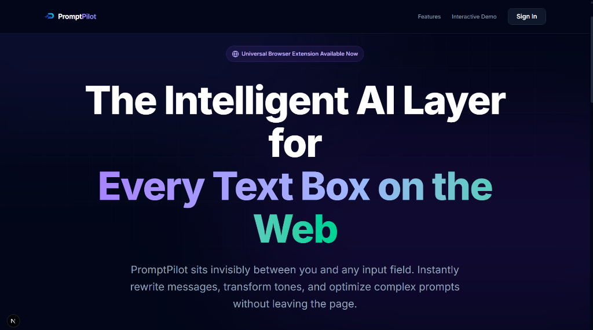

### Authentication Portal
Users sign in via a polished modal overlay using Google OAuth or email/password credentials. The landing page hero section is visible behind the modal.


---

## 📖 Table of Contents

1. [Executive Project Overview](#1-executive-project-overview)
2. [Architecture Overview](#2-architecture-overview)
3. [Technology Stack](#3-technology-stack)
4. [Internal Workflows](#4-internal-workflows)
5. [Feature Deep Dive](#5-feature-deep-dive)
6. [Repository Structure](#6-repository-structure)
7. [API Documentation](#7-api-documentation)
8. [Database & Storage Design](#8-database--storage-design)
9. [Security & RBAC](#9-security--rbac)
10. [Performance & Scalability](#10-performance--scalability)
11. [Deployment Architecture](#11-deployment-architecture)
12. [CI/CD & Quality Engineering](#12-cicd--quality-engineering)
13. [Engineering Challenges & Solutions](#13-engineering-challenges--solutions)
14. [Future Roadmap](#14-future-roadmap)
15. [Why This Project Matters](#15-why-this-project-matters)
16. [Setup & Execution](#16-setup--execution)

---

## 1. Executive Project Overview

### Project Vision
To provide a consolidated workspace that structures, validates, and runs prompts across multiple model providers. By storing configuration parameters and custom API keys directly in user profiles, the platform serves as a cost-free personal gateway that avoids markup fees.

### The Business & Technical Problem
1. **Instruction Inefficiency**: Developers often rely on unstructured, trial-and-error prompt drafting.
2. **Context Switching**: Interacting with LLMs (Gemini, Claude, GPT) requires moving between different browser tabs and web portals.
3. **Downstream Authentication Sync**: Secondary browser overlays require unified auth sync across domain boundaries without risking credential leaks.
4. **Data Ownership and Privacy**: Storing proprietary prompts, system credentials, and version history requires strict user-scoped database isolation and clear data purging mechanisms.

### Core Value Proposition & Differentiators
* **Multi-LLM Integration**: Direct connection with Gemini, OpenAI, Anthropic, and OpenRouter completion models.
* **Granular Prompt Grading**: Automatically evaluates drafts on a 0-100 scale across five architectural dimensions (Clarity, Context, Constraints, Structure, Specificity) and returns structured JSON suggestions.
* **Privacy-First Soft Delete**: Implements a secure database-level deletion timer that locks profiles, schedules 30-day hard purges, and allows reactive one-click account restoration.
* **Centralized Auth & API Gateway**: Downstream browser extensions or mobile clients utilize the web app's Edge routes (`/api/prompt/process`) and sync user credentials securely.

---

## 2. Architecture Overview

### High-Level System Architecture

The web application coordinates the frontend dashboard pages, Supabase JWT session handlers, and serverless Edge routers that query external model endpoints.

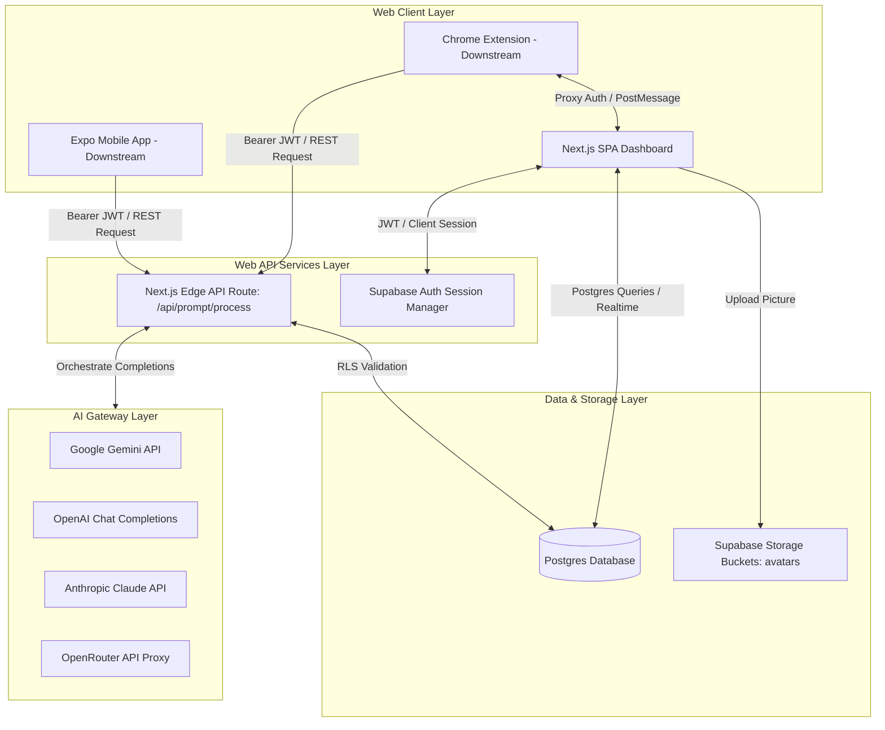

### Architecture Principles
* **Separation of Concerns**: The frontend manages the UI state, the edge routes coordinate AI call schemas, and PL/pgSQL database scripts enforce schema rules.
* **Secure Multitenancy**: PostgreSQL Row-Level Security (RLS) is enabled on all tables, isolating data across multiple tenants.
* **Structured Model Abstraction**: The server orchestrates System Messages and completion parameters under a single provider API wrapper.
* **CORS-Free Proxying**: Content scripts call Next.js routes through background service worker proxies, preventing preflight restrictions on third-party domains.

### Design Patterns
* **Service Layer Pattern**: Implemented in `web/src/lib/ai.ts` via `callLLM`, which abstracts formatting structures (System prompts, JSON output parameters, error fallbacks) across multiple providers.
* **Repository/Direct Access Pattern**: Leverages Supabase Client SDK for database operations, avoiding heavy ORM layers while retaining type safety.
* **Real-time Observer Pattern**: Subscribes to the `public.users` table changes via Supabase Channels, updating user sessions when account status changes.

---

## 3. Technology Stack

### Web Component Tech Stack

| Technology Layer | Chosen Technology | Rationale | Role |
| :--- | :--- | :--- | :--- |
| **Frontend Framework** | Next.js 16.2 (App Router) | Combines client React components with server API routes in a single codebase. | Client dashboard pages & API routes. |
| **Styling Engine** | Tailwind CSS 4.0 | Utility-first compilation that provides glassmorphism visual designs. | Layout aesthetics, responsive side-panel. |
| **UI Components** | Lucide React | High-performance, lightweight SVG icon package. | Navigation and action indicators. |
| **Database** | PostgreSQL (Supabase) | Relational integrity, built-in JSONB column parsing, RLS, and PL/pgSQL custom code. | Multi-tenant persistent data store. |
| **Authentication** | Supabase Auth (JWT) | Fast configuration, supports both Email/Password and Google OAuth. | Session control and API JWT generation. |
| **Object Storage** | Supabase Storage | Direct integration with RLS and folder partition triggers. | Storing profile avatars in `avatars` bucket. |
| **Realtime Engine** | Supabase Realtime (WAL) | Listens directly to Postgres Write-Ahead Log events. | Real-time deletion status synchronization. |
| **AI Gateway** | Native Fetch API | Reduces third-party library overhead; directly queries REST completion APIs. | Model completion request execution. |
| **Developer Utilities** | TypeScript 5.x | Enforces strict static type checks across API routes and forms. | Type safety across client-server boundaries. |

---

## 4. Internal Workflows

### Authentication Flow
Ensures that Next.js client contexts, Supabase DB tables, and secondary browser extensions sync sessions using JWT credentials.

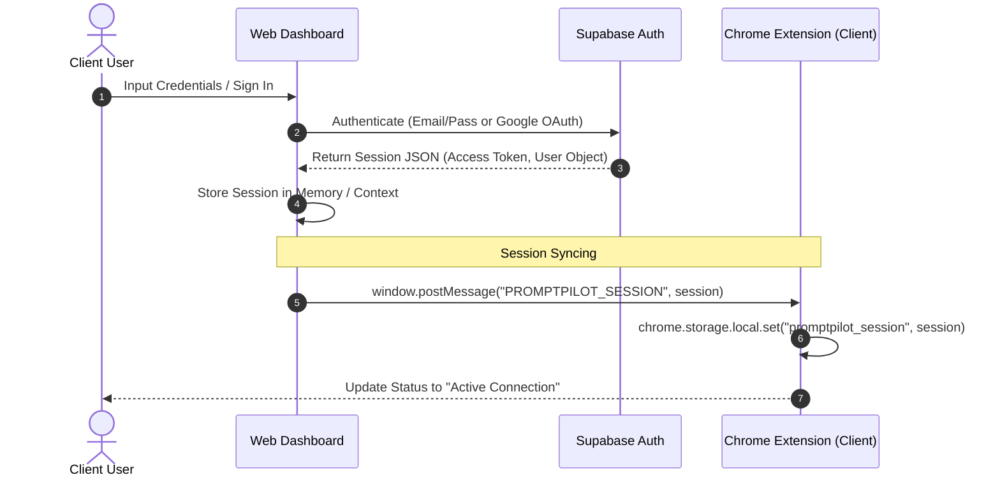

---

### Prompt Optimization & Processing Pipeline
Demonstrates how the backend processes user drafts, retrieves user settings, routes to target models, scores the prompt, and logs results.

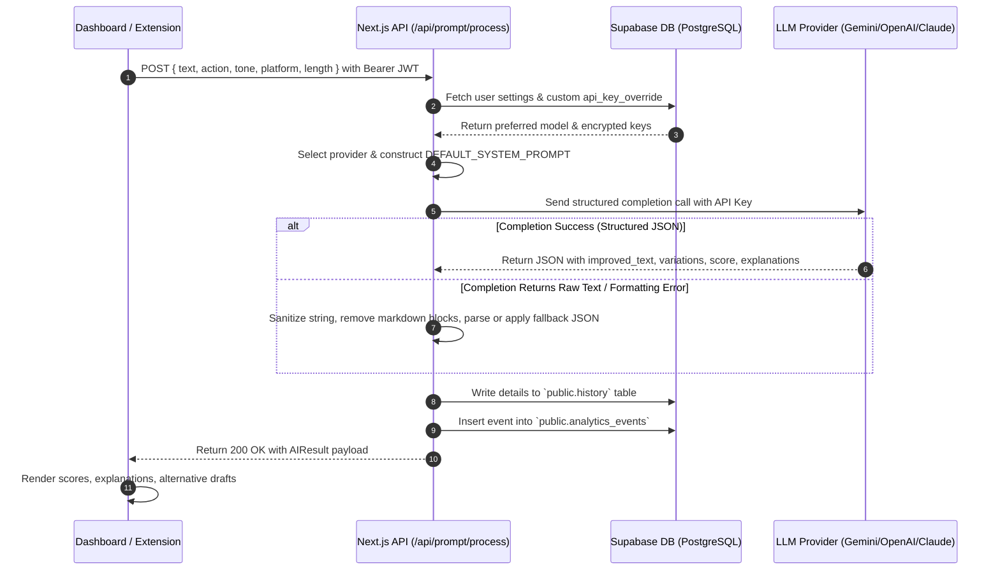

---

### Profile Picture Upload Flow
Demonstrates the secure storage workflow for user profile avatars.
1. **Selection**: User selects an image in the UI. The client validates the MIME type (`image/*`) and checks that the size is under 2MB.
2. **Storage Write**: The client sends a REST request to Supabase Storage via `supabase.storage.from('avatars').upload(...)`.
3. **RLS Authorization**: Supabase Storage checks the policy:
   ```sql
   bucket_id = 'avatars' 
   and auth.role() = 'authenticated'
   and (storage.foldername(name))[1] = auth.uid()::text
   ```
   Ensuring files can only be written to `/avatars/{user_id}/filename.png`.
4. **URL Update**: The client retrieves the public URL and updates the `users` profile table and Auth metadata.

---

### Soft-Delete & Account Deletion Flow
This workflow guarantees privacy while preventing accidental loss of user prompt histories.

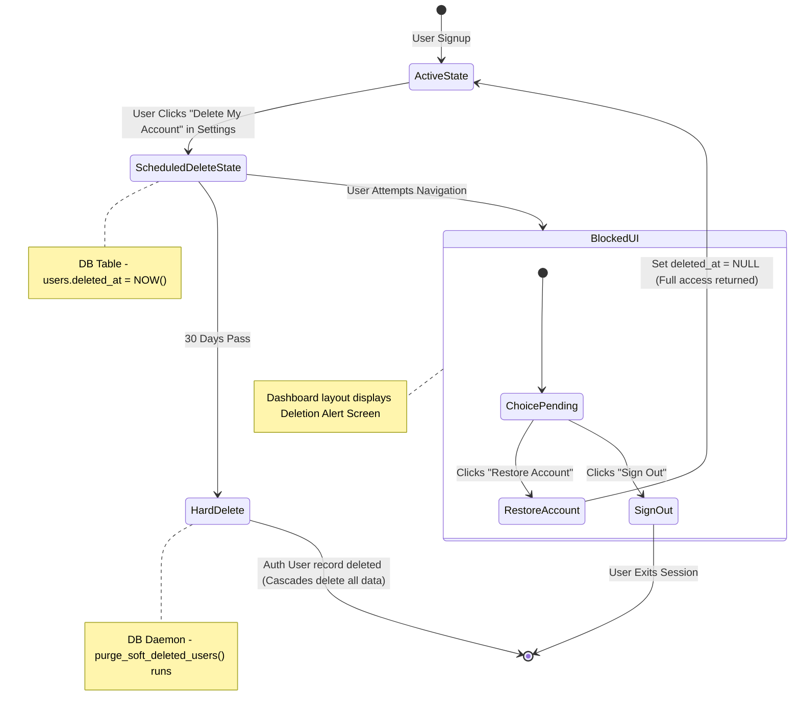

---

## 5. Feature Deep Dive

### AI Optimizer & Tone Rewrite
The central workspace includes a multi-functional editor panel. Users toggle between two core processing states:
1. **Optimize Prompt**: Analyzes the weak input string and restructures it by appending:
   * **Role Definition**: Assigns an expert persona (e.g., Senior TypeScript Developer, ATS Resume Writer).
   * **Context**: Sets the target goal and domain boundaries.
   * **Constraints**: Adds explicit rules (e.g., "Do not use markdown code block wrappers inside the JSON fields").
   * **Output Rules**: Enforces exact response formats.
2. **Rewrite Text**: Modifies professional drafts, casual messages, or executive emails using custom tone settings (Friendly, Professional, Executive, Casual) and length bounds (Shorten, Expand, Simplify).

#### Empty Pipeline State
Shows the clean workspace before a prompt is submitted — with tone, platform, and action controls ready for input.
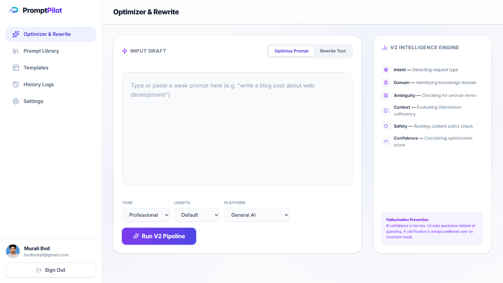

#### Contextual Clarification — Question Prompt
When the AI determines that additional background is needed to fully optimize the prompt, it surfaces a targeted clarification question before proceeding.
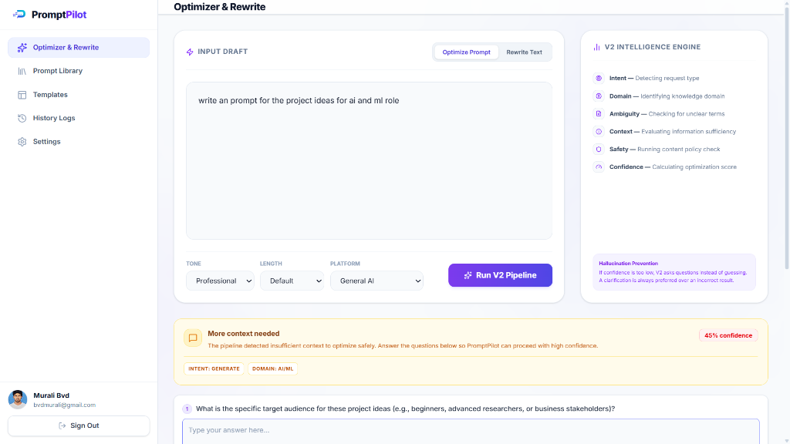

#### Contextual Clarification — User Response
The user provides the missing context directly in the panel, which the AI then folds into the final optimized output for a richer, more accurate result.
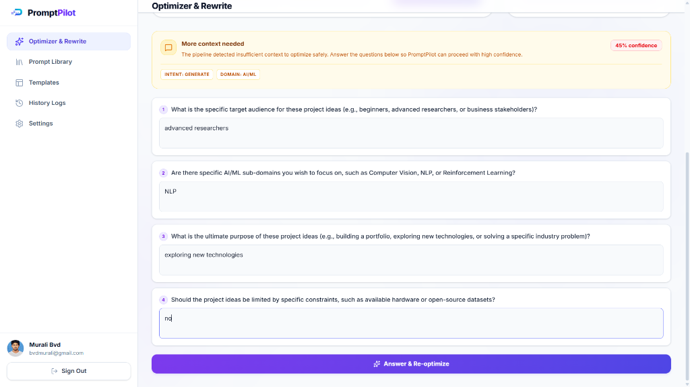

---

### Quality Scoring System
PromptPilot implements a real-time prompt grading dashboard. Once processed, it returns a 0-100 rating scale across five distinct quality pillars:
* **Clarity**: Checks if the target prompt is free of ambiguous vocabulary.
* **Context**: Verifies if background constraints are clearly explained.
* **Constraints**: Grades the presence of limits (e.g., length, parameters).
* **Structure**: Checks if headers, markdown, or bracket variables organize the input.
* **Specificity**: Scores how detailed the instructions are.

It maps out structured adjustments (Actions, Why, How) so users learn how to write better prompts:
* **Action**: "Added persona".
* **Why**: "Instructing the AI to act as an expert creates more authoritative responses".
* **How**: "Prepended 'Act as an expert fitness writer...' to the draft".

#### Score Metrics Interface
Provides a detailed visual breakdown of prompt quality scores, along with explanations and suggestions.
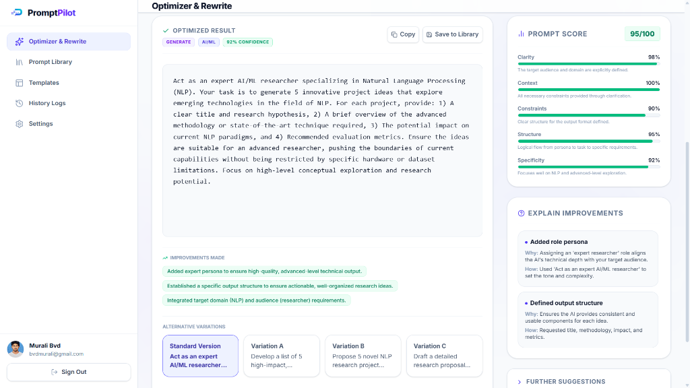

---

### Version Control & Prompt Library
Users save optimized outputs directly to their Prompt Library. The database maintains an active version history schema (`prompt_versions`), which stores a snapshot of every edit. Users can review past edits, compare prompt structures over time, copy old versions, and rollback revisions.

#### Prompt Library Page
Contains saved prompts organized by category (e.g., Coding, Social, Social Media), with quick copy, edit, and delete controls.
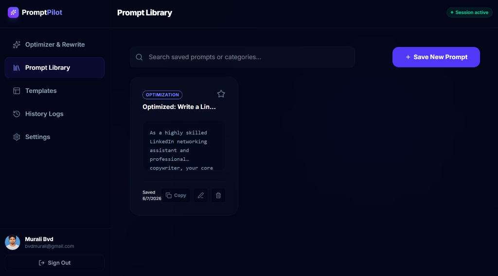

---

### Execution History Logs
PromptPilot keeps a historical ledger of all prompt engineering iterations in the `history` table. Users can review past draft variations, compare execution performance, and examine quality score evolutions over time.

#### History Logs Interface
Provides a chronological list of optimized prompts with overall scores and access to execution details.
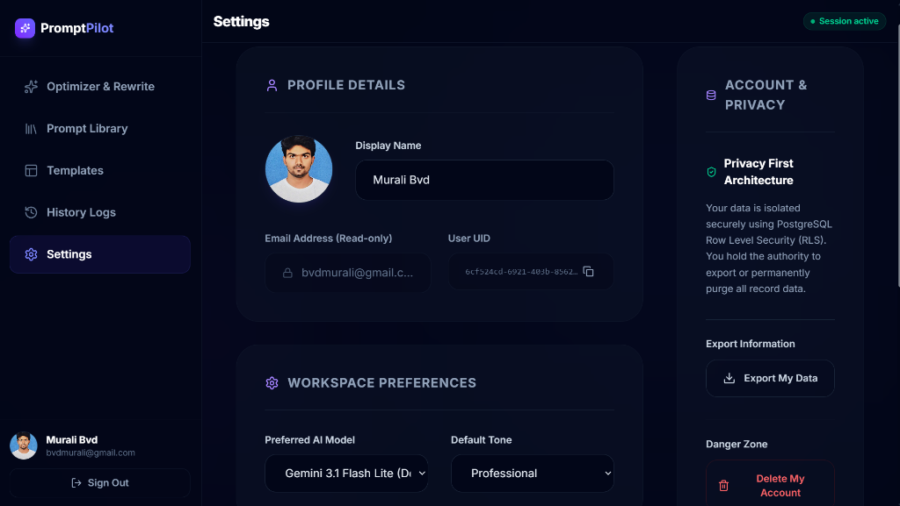

---

### Variable Binding Templates Engine
Templates are pre-structured prompt layouts containing bracketed placeholder fields (e.g., `[Target Role]`, `[Key Skills]`).
* **Dynamic Form Parsing**: When a user selects a template, the client parses all bracketed variables via regex: `/\[(.*?)\]/g`.
* **Interactive Binding UI**: Dynamically renders text inputs for each identified variable.
* **Compilation**: Binds the inputs back into the template, preparing the compiled text for copying or direct editing.

#### Templates Panel
Features pre-built system templates (e.g., Resume Builder, Cover Letter Generator, LinkedIn Outreach, SQL Generator) with interactive variable fields.


---

### Account Settings and Credentials Override
Users configure display names, upload profile avatars, choose default models, configure custom API keys, and download companion clients.

#### Account Settings Page
Provides general settings including profile name update, avatar upload, and account deletion options.


#### API Key Overrides & Mobile Application Download
The lower settings panel combines two companion sections side by side:
- **API Credentials Override**: Configure custom API keys for Google Gemini, OpenAI, Anthropic, and OpenRouter to use personal quotas and avoid shared rate limits.
- **Mobile Application Download**: Displays the latest Android APK version, file size, and release date alongside a scannable QR code and direct download button for instant phone installation.

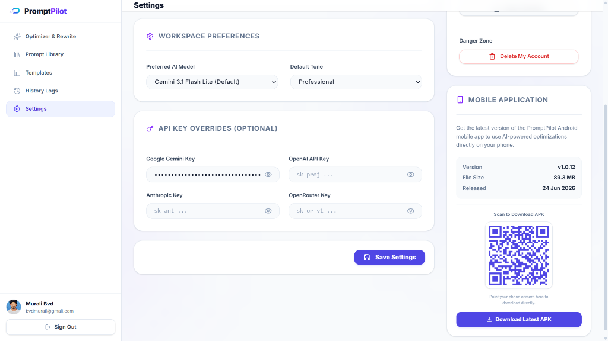

---

## 6. Repository Structure

Focuses exclusively on the web application directory and Supabase DB configurations.

```
/web/                             # Next.js Web Application
├── public/
│   └── assets/                   # Public-facing app screenshots & marketing images
├── src/
│   ├── app/                      # App Router pages & API routes
│   │   ├── api/
│   │   │   ├── auth/             # Authentication callbacks (Google OAuth)
│   │   │   ├── prompt/process/   # Core LLM completion handler (route.ts)
│   │   │   └── mobile/
│   │   │       ├── latest/       # GET: latest APK metadata & download redirect (route.ts)
│   │   │       └── webhook/      # POST: register new builds via webhook (route.ts)
│   │   ├── dashboard/            # Shell Layout & core workspace routes
│   │   │   ├── editor/           # Workspace editor route (page.tsx)
│   │   │   ├── library/          # Prompt library component (page.tsx)
│   │   │   ├── templates/        # Variable binding engine (page.tsx)
│   │   │   ├── history/          # Historical completion logs (page.tsx)
│   │   │   └── settings/         # Profile & mobile app download page (page.tsx)
│   │   ├── globals.css           # Tailwind custom rules
│   │   ├── layout.tsx            # Root app wrapper
│   │   └── page.tsx              # Product landing page & Auth modal UI
│   ├── context/                  # React Context providers (AuthContext.tsx)
│   ├── lib/                      # Utility scripts (ai.ts model router, cache.ts)
│   ├── middleware.ts             # Checks Auth tokens & intercepts dashboard routes
│   └── utils/                    # Supabase client initializer classes
├── tsconfig.json                 # TypeScript compilation specifications
└── package.json                  # Next.js build scripts and dependencies

/supabase/                        # Database Schema Configurations
├── config.toml                   # Local Supabase dev server ports & config
└── migrations/                   # Database migrations (Versioned SQL)
    ├── 20260606_init.sql         # Schema definitions, triggers, and RLS policies
    ├── 20260607_check_email.sql  # RPC function for validating email presence
    ├── 20260607_realtime.sql     # Adds users table to realtime publication
    ├── 20260607_soft_delete.sql  # Implements soft-delete column & RLS filters
    ├── 20260607_storage.sql      # Creates avatars bucket & access policies
    └── 20260624_mobile_builds.sql # Creates mobile_builds table & builds bucket
```

---

## 7. API Documentation

### POST `/api/prompt/process`

Orchestrates prompt optimization or rewriting.

* **Headers**:
  * `Authorization: Bearer <Supabase_JWT>` (Required for session validation)
  * `Content-Type: application/json`

* **Request Body Schema**:
  ```json
  {
    "text": "Write a python script to download a file",
    "action": "optimize",
    "tone": "professional",
    "length": "default",
    "platform": "chatgpt"
  }
  ```

| Parameter | Type | Required | Description |
| :--- | :--- | :--- | :--- |
| `text` | String | Yes | The raw draft prompt or text to process. |
| `action` | Enum | Yes | `optimize` (Prompt Engineering) or `rewrite` (Text Refinement). |
| `tone` | String | No | Tone parameter (`professional`, `casual`, `friendly`, `executive`). |
| `length` | String | No | Length constraint (`shorten`, `expand`, `simplify`, `summarize`). |
| `platform` | String | No | Target platform configuration (`chatgpt`, `claude`, `gemini`). |

* **Successful Response (`200 OK`)**:
  ```json
  {
    "improved_text": "Act as an expert Python Developer. Write a robust, clean script using the `requests` library to download a file from a specified URL...",
    "variations": [
      "Alternative Version A...",
      "Alternative Version B..."
    ],
    "score": {
      "overall": 95,
      "clarity": 95,
      "context": 90,
      "constraints": 90,
      "structure": 95,
      "specificity": 95
    },
    "suggestions": [
      "Add try-except blocks to catch connection errors",
      "Specify download directory as a command line argument"
    ],
    "explanations": [
      {
        "action": "Added persona",
        "why": "Assigning a role coordinates more accurate code syntax output.",
        "how": "Added 'Act as an expert Python Developer' instruction at start."
      }
    ]
  }
  ```

* **Error Responses**:
  * **`400 Bad Request`**: Missing required parameters.
    ```json
    { "error": "Missing required parameters: text and action" }
    ```
  * **`401 Unauthorized`**: Missing, expired, or invalid Supabase JWT.
    ```json
    { "error": "Unauthorized. Please log in to use PromptPilot API." }
    ```
  * **`500 Internal Server Error`**: Provider completion failure.
    ```json
    { "error": "No API key configured. Please add your API key in Settings..." }
    ```

---

### GET `/api/mobile/latest`

Retrieves metadata about the latest mobile APK build or redirects to download.

* **Parameters**:
  * `download` (Optional Query Parameter): Set `?download=true` to redirect (`307 Temporary Redirect`) to the direct APK file URL.

* **Successful Response (`200 OK` without `download` param)**:
  ```json
  {
    "id": "7b524cd-6921-403b-8562-c8e41d9bf011",
    "version": "1.0.12",
    "build_number": 12,
    "platform": "android",
    "file_url": "https://expo.dev/artifacts/eas/abc.apk",
    "file_size_bytes": 93623912,
    "release_notes": "- Add settings UI overrides\n- Full key management support",
    "created_at": "2026-06-24T13:21:29Z"
  }
  ```

* **Response with `?download=true`**:
  * Status: `307 Temporary Redirect`
  * Header `Location`: Direct download URL (Expo CDN/Supabase Storage)

---

### POST `/api/mobile/webhook`

Registers new mobile builds. Deletes all previous builds from storage and database records automatically to save space.

* **Headers**:
  * `Authorization: Bearer <MOBILE_BUILD_WEBHOOK_SECRET>`
  * `Content-Type: application/json`

* **Request Body Schema**:
  ```json
  {
    "version": "1.0.12",
    "build_number": 12,
    "platform": "android",
    "file_url": "https://expo.dev/artifacts/eas/abc.apk",
    "file_size_bytes": 93623912,
    "release_notes": "Initial release"
  }
  ```

* **Successful Response (`200 OK`)**:
  ```json
  { "success": true, "message": "Successfully recorded mobile build" }
  ```

---

## 8. Database & Storage Design

### Database Tables Schema

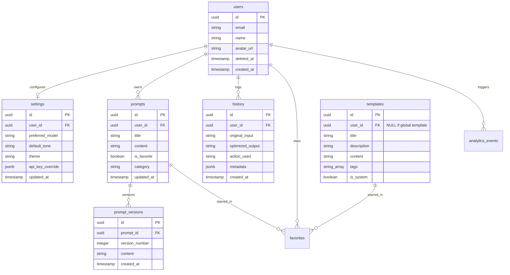

### Database Triggers & PL/pgSQL Code
1. **User Auto-Creation**: When a user registers via Supabase Auth, a trigger copies the user metadata to `public.users`:
   ```sql
   create trigger on_auth_user_created
     after insert on auth.users
     for each row execute procedure public.handle_new_user();
   ```
2. **Settings Auto-Initialization**: When a user profile is created, default preferences are initialized in the `settings` table:
   ```sql
   create trigger on_profile_created_settings
     after insert on public.users
     for each row execute procedure public.handle_new_user_settings();
   ```
3. **Soft-Delete Purge Daemon**: A daily worker deletes soft-deleted users and their data after 30 days:
   ```sql
   create or replace function public.purge_soft_deleted_users()
   returns void as $$
   begin
     delete from auth.users
     where id in (
       select id 
       from public.users 
       where deleted_at is not null 
       and deleted_at < now() - interval '30 days'
     );
   end;
   $$ language plpgsql security definer;
   ```

---

## 9. Security & RBAC

### Authentication & Authorization
* **JSON Web Tokens (JWT)**: Client requests send a bearer token generated by Supabase Auth. The server parses this JWT to verify the user's signature.
* **Row-Level Security (RLS)**: Policies check the user's ID against the target table's row ownership.
  * **Settings Isolation Policy**:
    ```sql
    create policy "Users can manage their own settings" on public.settings
      for all using (auth.uid() = user_id);
    ```
  * **Templates Access Policy**:
    ```sql
    create policy "Anyone can view system templates, users can view their own" on public.templates
      for select using (user_id is null or auth.uid() = user_id);
    ```

### Input Validation & Data Security
* **SQL Injection Mitigation**: All Postgres interactions utilize parameterized inputs via Supabase Client library APIs.
* **Sanitization**: System credentials (e.g., custom API keys stored in `settings.api_key_override`) are scoped under private user settings, isolated by RLS, and only accessed on the server side. They are never sent back to the client.

---

## 10. Performance & Scalability

### Caching Strategy
* **Client Session Cache**: Supabase session tokens are cached in browser local storage and extension storage.
* **LLM Completion Gateway Cache**: The server route `/api/prompt/process` fetches the user's credentials and model preferences. This query uses optimized Postgres indexes, avoiding heavy table joins.

### Connection Pooling & Scaling
* **Database Connection Pooling**: Supabase uses Supavisor for connection pooling. This maintains connections for serverless actions, preventing DB connection exhaustion during traffic spikes.
* **Future Vector Index Scaling**: For contextual database matches (Phase 3 RAG integration), the database can be scaled by enabling the `pgvector` extension and indexing prompts using Hierarchical Navigable Small World (HNSW) graphs.

---

## 11. Deployment Architecture

### Local Development Setup
1. **Local Database Configuration**: Spin up local Dockerized Postgres containers, Supabase APIs, and SMTP servers via CLI:
   ```bash
   supabase start
   supabase db reset
   ```
2. **Next.js Development Server**:
   ```bash
   cd web
   npm install
   npm run dev
   ```

### Production Setup
* **Web App Hosting**: Deployed on Vercel's global Edge network, utilizing edge routing and serverless cold-start optimization.
  * **Live URL**: [prompt-pilot-ochre.vercel.app](https://prompt-pilot-ochre.vercel.app)
* **Database Hosting**: Deployed on Supabase Cloud.

#### Live Dashboard Interface
The live production deployment of PromptPilot captured in-browser at [prompt-pilot-ochre.vercel.app](https://prompt-pilot-ochre.vercel.app) — showing the full hero landing page with the "Universal Browser Extension Available Now" announcement banner.
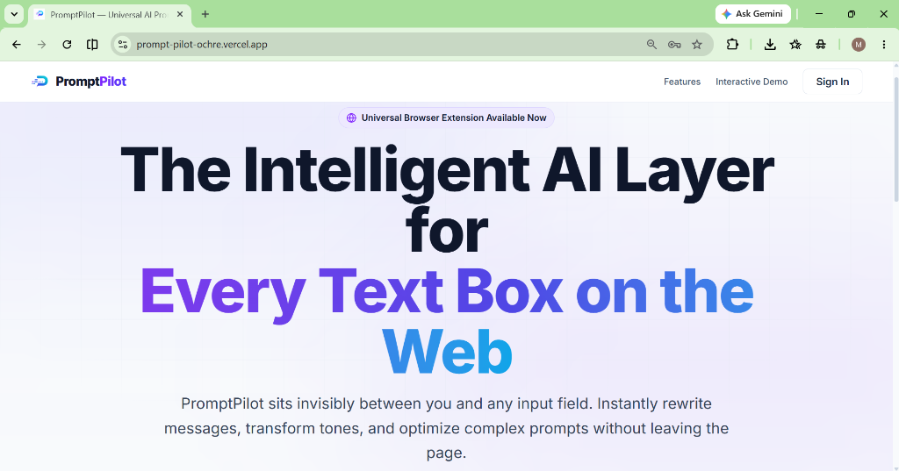

### Core Environment Variables (`web/.env.local`)
```env
NEXT_PUBLIC_SUPABASE_URL=https://your-project-id.supabase.co
NEXT_PUBLIC_SUPABASE_PUBLISHABLE_KEY=eyJhbGciOi...
SUPABASE_SERVICE_ROLE_KEY=eyJhbGciOi...
```

---

## 12. CI/CD & Quality Engineering

### Testing Strategy
* **Unit Testing**: Runs isolated checks on helper algorithms (e.g., template variable compilation, JSON string sanitizers, schema validation tools).
* **Supabase Local Testing**: Validates RLS policies using database verification scripts:
   ```bash
   supabase db test
   ```

### Automated Code Quality Controls
* **ESLint Verification**: Next.js ESLint packages validate coding standards on every commit.
* **Strict TypeScript Type-Checking**: Compiles code with `noImplicitAny` and strict null checking configured in `tsconfig.json`.

---

## 13. Engineering Challenges & Solutions

### Challenge 1: Downstream CORS Restrictions for Extensions
* **Problem**: Downstream client instances (like the Chrome Extension content scripts) attempting direct requests to `localhost:3000/api/prompt/process` from third-party sites (e.g., Gmail, ChatGPT) are blocked by browser Same-Origin Policies.
* **Solution**: Implemented an API Proxy Pattern. The extension's content script delegates the API call to a background service worker using runtime messaging:
  ```typescript
  chrome.runtime.sendMessage({ type: "PROMPTPILOT_API_REQUEST", payload: { ... } });
  ```
  The background worker (`background.ts`) executes the fetch call. Since service workers operate outside site document limits, they bypass browser CORS checks, keeping user session tokens secure.

---

### Challenge 2: Parsing Non-JSON Output and Structuring LLM Responses
* **Problem**: Under heavy loads, AI providers occasionally fail to follow system instructions and wrap their outputs in markdown code blocks (e.g., ` ```json { ... } ``` `) instead of returning raw JSON, which breaks JSON parsing:
  ```typescript
  JSON.parse(responseText) // Throws SyntaxError
  ```
* **Solution**: Developed a sanitization and parser fallback wrapper in the API:
  ```typescript
  let sanitized = responseText.trim();
  if (sanitized.startsWith('```')) {
    sanitized = sanitized.replace(/^```json\s*/i, '').replace(/```$/, '');
  }
  const result: AIResult = JSON.parse(sanitized.trim());
  ```
  If parsing still fails, it extracts the raw text and populates a fallback JSON structure with default scores and explanations to prevent server crashes.

---

### Challenge 3: Secure API Key Delegation
* **Problem**: Allowing users to bring their own API keys simplifies pricing, but exposing keys to the client UI violates basic security principles.
* **Solution**: Keys are saved to the Supabase database in a private JSONB column (`settings.api_key_override`). Row Level Security rules restrict reading/writing this column to the authenticated owner. When optimizing a prompt, the keys are fetched securely on the server side and used to complete requests. They are never sent back to the client interface.

---

## 14. Future Roadmap

### Phase 1: Current Base System (Completed)
* Next.js App Router and Supabase Auth.
* Prompt Library and Template Variable Engine.
* Account Soft-Deletion with countdown restoration alerts.
* Universal Browser Extension overlay integration.

### Phase 2: Collaboration & Prompt Version Rollbacks
* Team workspace invite links.
* Collaborative prompt editing.
* Visual git-like diff logs to compare and revert revisions.

### Phase 3: Semantic Search & Vector Retrieval
* Enable the `pgvector` extension in Supabase.
* Automatically generate embeddings for saved prompts and templates.
* Semantic search in the library.

### Phase 4: Automated Testing & Evaluation
* Run prompts against test variables.
* Generate automated scoring sheets using different model completion APIs.

### Phase 5: Enterprise Scaling
* Active-active DB replication.
* Custom SSO/SAML integrations.
* SOC2-compliant logging systems.

---

## 15. Why This Project Matters

PromptPilot demonstrates production-grade system architecture and engineering maturity:
* **System Design & Integration**: Integrates web, extension, and mobile environments around a centralized database and API gateway.
* **Database Expertise**: Uses advanced PostgreSQL configurations (RLS, PL/pgSQL database functions, automatic trigger pipelines).
* **AI Product Strategy**: Implements custom key overrides, multi-model support, and grading structures that help users write better prompts.
* **Security & Performance**: Protects user credentials, uses connection pooling, and handles CORS bypass rules securely.

---

## 16. Setup & Execution

### Local Development
Ensure you have docker installed.

1. **Supabase Local Setup**:
   ```bash
   # start services
   supabase start
   
   # run migrations
   supabase db reset
   ```
2. **Web Server Startup**:
   ```bash
   cd web
   npm install
   npm run dev
   ```
3. **Open Browser**: navigate to [http://localhost:3000](http://localhost:3000).
